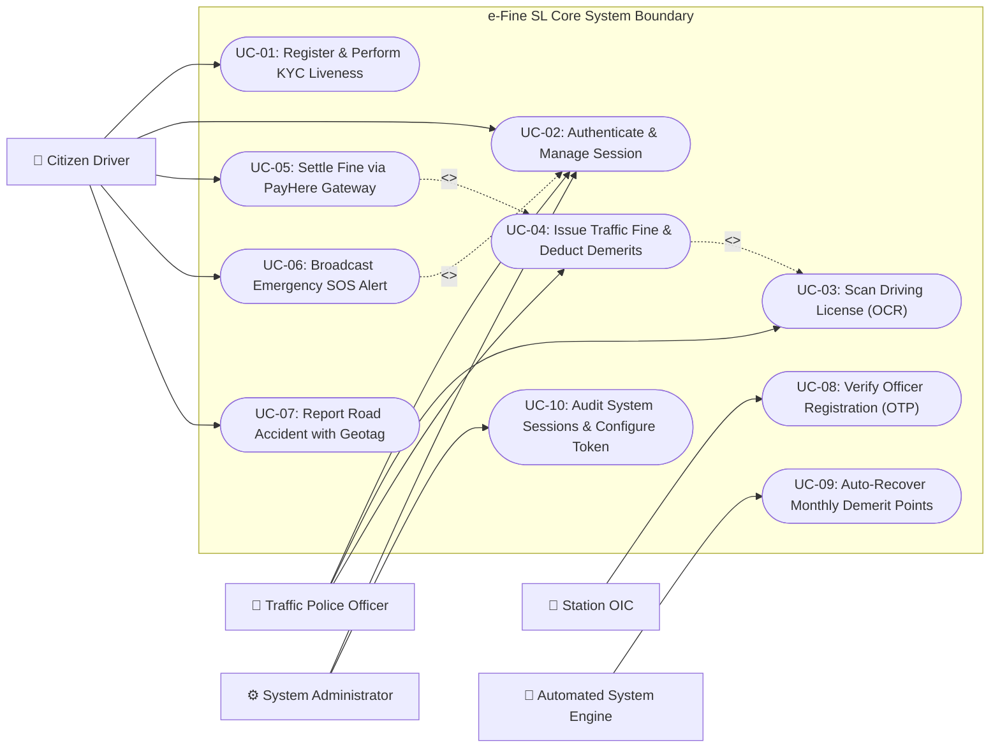
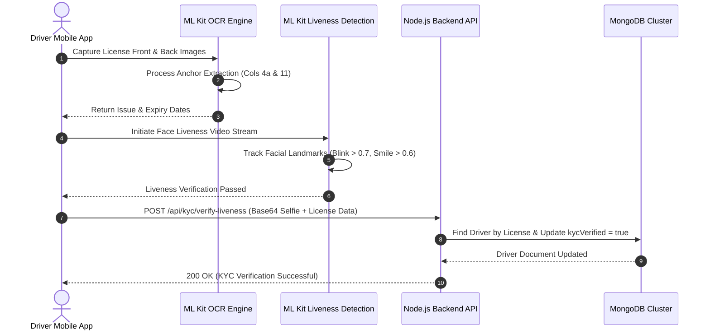
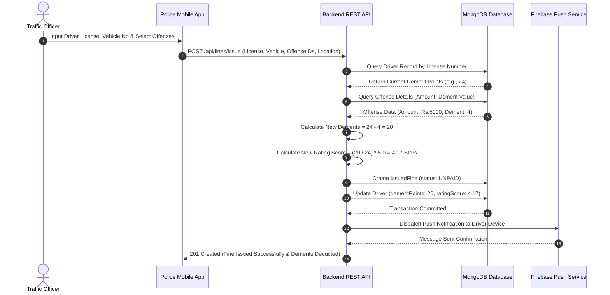
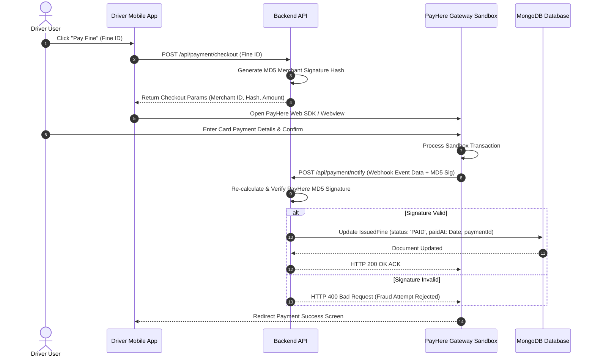
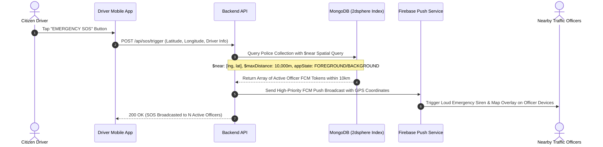
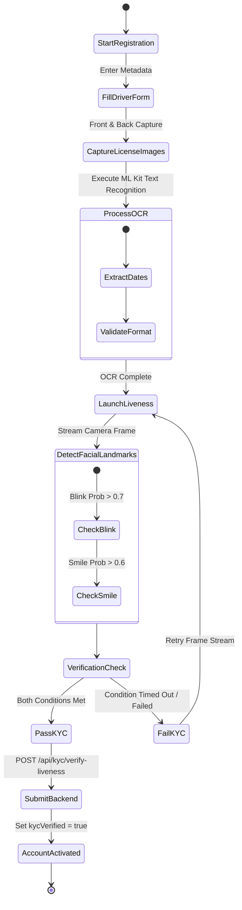
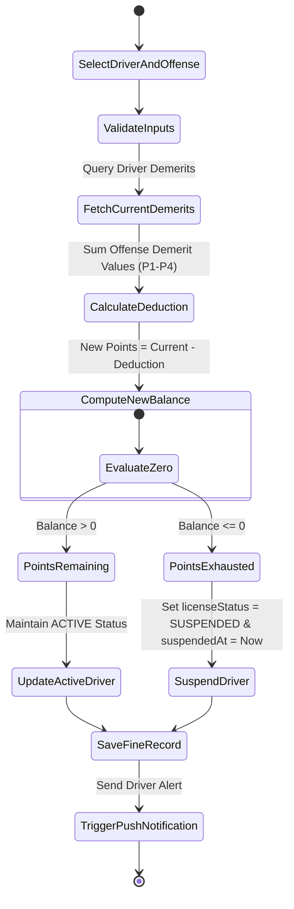
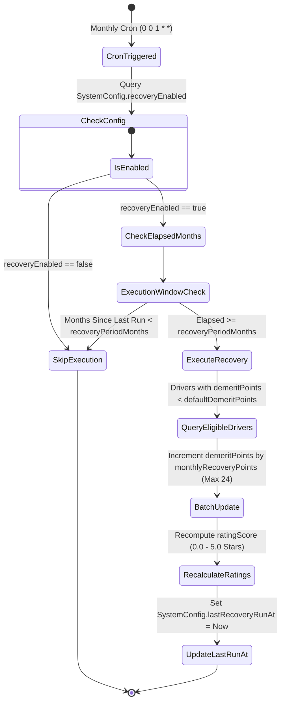
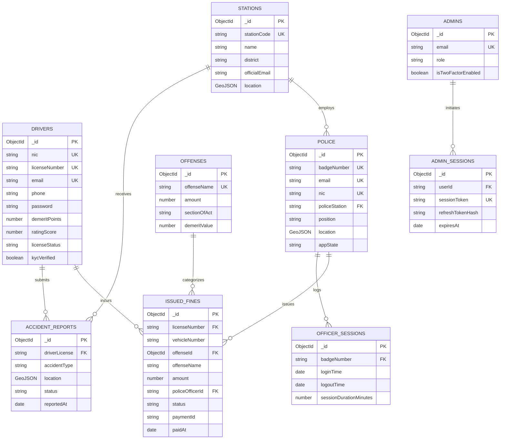

# e-Fine SL Traffic Management & Automated Enforcement System
### Senior Systems Architecture & System Design Documentation

[](https://github.com/your-repo)
[](https://nodejs.org)
[](https://flutter.dev)
[](https://mongodb.com)
[](#)

---

## 📌 Executive Table of Contents

- [4.1 Introduction](#41-introduction)
  - [4.1.1 System Overview & Domain Context](#411-system-overview--domain-context)
  - [4.1.2 High-Level System Architecture](#412-high-level-system-architecture)
  - [4.1.3 Core Stakeholder Roles & Access Matrices](#413-core-stakeholder-roles--access-matrices)
- [4.2 System Design Process](#42-system-design-process)
  - [4.2.1 Use Case Diagrams & Detailed Specifications](#421-use-case-diagrams--detailed-specifications)
  - [4.2.2 Unified System Class Diagram](#422-unified-system-class-diagram)
  - [4.2.3 Sequence Diagrams](#423-sequence-diagrams)
  - [4.2.4 Activity Diagrams](#424-activity-diagrams)
- [4.3 Interface Design](#43-interface-design)
  - [4.3.1 Architectural UI/UX Design Principles](#431-architectural-uiux-design-principles)
  - [4.3.2 Screen-by-Screen Layout & Wireframe Specifications](#432-screen-by-screen-layout--wireframe-specifications)
- [4.4 Database Design](#44-database-design)
  - [4.4.1 Entity Relationship Diagram (ERD)](#441-entity-relationship-diagram-erd)
  - [4.4.2 Comprehensive Normalization Analysis (1NF to BCNF & Denormalization)](#442-comprehensive-normalization-analysis-1nf-to-bcnf--denormalization)
  - [4.4.3 Complete Relational Schema & Data Dictionary](#443-complete-relational-schema--data-dictionary)

---

## 4.1 Introduction

### 4.1.1 System Overview & Domain Context
The **e-Fine SL Traffic Management System** is a next-generation enterprise traffic law enforcement, digital fine ticketing, and driver safety ecosystem engineered specifically for the Sri Lanka Police Department and the Department of Motor Traffic (DMT). 

Traditional traffic enforcement in Sri Lanka relies on paper-based fine tickets, physical license retention, manual bank/post office payments, and disconnected driver record keeping. This creates severe operational bottlenecks, delays in fine collection, revenue leakage, and inability to enforce real-time penalty point deductions or emergency roadside assistance.

**e-Fine SL** digitizes the entire lifecycle of traffic law enforcement through:
1. **Real-time Mobile Spot Fines:** Traffic officers issue digitized fines roadside via Flutter mobile app with automated license/vehicle OCR text recognition.
2. **Dynamic Demerit Point Engine:** Driver starting points (default: 24) are automatically deducted based on offense severity levels (P1-P4). Driving licenses are auto-suspended upon reaching 0 points.
3. **KYC & Liveness Verification:** AI-driven facial liveness verification ("blink & smile" detection via Google ML Kit) prevents identity fraud during citizen registration.
4. **Instant Payment Gateway:** Integration with PayHere Sandbox PG enables drivers to settle fines online via credit card/digital wallet without visiting post offices.
5. **Geospatial Emergency SOS & Accident Reporting:** Citizens broadcast live location alerts ($near queries in 10km radius) directly to active police officers and stations via WebSockets & Firebase FCM.

---

### 4.1.2 High-Level System Architecture

The system follows a modern **Decoupled Client-Server Micro-capable Architecture** with real-time geospatial processing and asynchronous background engines.

```mermaid
graph TD
    subgraph Client Layer (Presentation)
        FlutterDriver["Flutter Mobile App (Driver Module)"]
        FlutterPolice["Flutter Mobile App (Police Officer Module)"]
        WebAdmin["React / Vue Web Admin Portal"]
    end

    subgraph Security & API Gateway Layer
        CorsAuth["CORS & Security Middleware"]
        JWTAuth["JWT Access Token / Refresh Token Engine"]
        CryptoService["RSA Key Exchange (public.pem / Private Key)"]
    end

    subgraph Monolithic Backend API Layer (Node.js + Express)
        AuthCtrl["Auth & Verification Controller"]
        FineCtrl["Fine & Demerit Controller"]
        AccidentCtrl["Accident & Incident Controller"]
        SOSCtrl["Geospatial SOS Engine"]
        AdminCtrl["Admin & System Config Controller"]
        PaymentCtrl["PayHere Payment Gateway Controller"]
    end

    subgraph Asynchronous Engines & Background Jobs
        CronJob["Node-Cron Demerit Recovery Engine"]
        FCMService["Firebase Admin SDK (FCM Push Service)"]
        EmailService["Nodemailer (SendGrid / SMTP Gateway)"]
    end

    subgraph Data & Persistence Layer
        MongoDB[(MongoDB Primary Cluster)]
        GeoIndex["MongoDB 2dsphere Spatial Index"]
    end

    FlutterDriver -->|HTTPS / REST API| CorsAuth
    FlutterPolice -->|HTTPS / REST API| CorsAuth
    WebAdmin -->|HTTPS / REST API| CorsAuth

    CorsAuth --> JWTAuth
    JWTAuth --> CryptoService
    CryptoService --> AuthCtrl & FineCtrl & AccidentCtrl & SOSCtrl & AdminCtrl & PaymentCtrl

    AuthCtrl --> MongoDB
    FineCtrl --> MongoDB
    AccidentCtrl --> MongoDB
    SOSCtrl --> GeoIndex
    AdminCtrl --> MongoDB
    PaymentCtrl --> MongoDB

    SOSCtrl --> FCMService
    AccidentCtrl --> EmailService
    AuthCtrl --> EmailService
    CronJob -->|Monthly Auto-Recovery| FineCtrl
```

---

### 4.1.3 Core Stakeholder Roles & Access Matrices

The system implements Role-Based Access Control (RBAC) across 6 distinct user personas:

| Role Code | Role Name | Primary Interface | Access Capabilities & Scopes |
| :--- | :--- | :--- | :--- |
| `ROLES.DRIVER` | Citizen Driver | Driver Mobile App | Account signup (KYC required), view license status & demerits, view/pay issued fines, report roadside accidents, trigger Emergency SOS. |
| `ROLES.OFFICER` | Police Traffic Officer | Police Mobile App | Duty presence toggle (GPS), scan driving licenses (OCR), issue spot fines, view daily statistics, receive nearby SOS & accident alerts. |
| `ROLES.OIC` | Police Station OIC | Police App / Web | Officer registration verification (OTP generation), station fine analytics, accident report acknowledgment & assignment. |
| `ROLES.ADMIN_OFFICER` | Admin Officer | Admin Web Portal | System configuration management, station registry maintenance, offense catalog CRUD, driver/officer audit log inspection. |
| `ROLES.FINANCE_OFFICER` | Financial Auditor | Admin Web Portal | Fine payment revenue aggregation, PayHere transaction reconciliation, unpaid fine escalation reports. |
| `ROLES.SUPER_ADMIN` | System Super Admin | Admin Web Portal | Full system control, 2FA admin management, JWT token duration configuration, session token revocation, system reset capability. |

---

## 4.2 System Design Process

### 4.2.1 Use Case Diagrams & Detailed Specifications

#### System Use Case Diagram



#### Detailed Use Case Specifications

##### UC-01: Citizen Driver Registration & KYC Liveness Verification
- **Primary Actor:** Citizen Driver
- **Pre-conditions:** Driver possesses valid Sri Lankan Driving License and smartphone camera.
- **Main Success Scenario:**
  1. Driver inputs personal metadata (NIC, Name, Email, Phone, License No, Vehicle Class).
  2. System captures Front and Back images of the Sri Lankan Driving License.
  3. System initiates OCR processing via ML Kit to extract Document Date of Issue (4a) and Expiry (11).
  4. System prompts driver for real-time selfie video stream.
  5. Google ML Kit evaluates Liveness Detection parameters (Blink Detection Probability > 0.7, Smile Probability > 0.6).
  6. Backend hashes password using Bcrypt (salt round 10) and stores driver record with `kycVerified: true`.
- **Post-conditions:** Driver account activated with initial 24 demerit points and 5.0 Rating Score.

##### UC-04: Roadside Spot Fine Issuance & Automated Demerit Deduction
- **Primary Actor:** Traffic Police Officer
- **Pre-conditions:** Officer logged in with active duty presence (`appState: 'FOREGROUND'`).
- **Main Success Scenario:**
  1. Officer inputs or scans Driver License Number and Vehicle Registration Number.
  2. Officer selects one or multiple traffic offenses from the Offense Catalog (e.g., Speeding, No Helmet).
  3. Backend fetches Offense Demerit Value (P1=1, P2=2, P3=3, P4=4) and fine amount.
  4. System calculates total demerit points to deduct and updates Driver `demeritPoints`.
  5. System calculates new Driver `ratingScore` (Scale 0.0 - 5.0 stars).
  6. If `demeritPoints` reaches 0, system sets `licenseStatus: 'SUSPENDED'` and records `suspendedAt`.
  7. System writes `IssuedFine` document with status `UNPAID` and sends real-time push alert to driver.
- **Post-conditions:** Fine recorded, driver demerits updated, push notification dispatched.

##### UC-05: Fine Settlement via PayHere Payment Gateway Sandbox
- **Primary Actor:** Citizen Driver
- **Pre-conditions:** Driver has unpaid fine linked to their driving license.
- **Main Success Scenario:**
  1. Driver views fine list on mobile app and selects "Pay Now".
  2. App requests checkout payload from `/api/payment/checkout`.
  3. Backend generates MD5 signature hash matching PayHere merchant credentials.
  4. App launches PayHere Web SDK / Webview checkout.
  5. Driver enters payment card/wallet details in PayHere sandbox.
  6. PayHere PG posts HTTP webhook notification to `/api/payment/notify`.
  7. Backend validates PayHere MD5 signature hash.
  8. System updates `IssuedFine` status to `PAID`, sets `paidAt`, and records `paymentId`.
- **Post-conditions:** Fine status marked `PAID`, transaction log finalized.

---

### 4.2.2 Unified System Class Diagram

```mermaid
classDiagram
    class Driver {
        +ObjectId _id
        +String name
        +String nic
        +String licenseNumber
        +String email
        +String phone
        +String password
        +String role
        +Number demeritPoints
        +Number ratingScore
        +String licenseStatus
        +String demeritLevel
        +Date suspendedAt
        +Boolean isVerified
        +Boolean kycVerified
        +Boolean emailIsVerified
        +String profileImage
        +String licenseFrontImage
        +String licenseBackImage
        +String licenseExpiryDate
        +String licenseIssueDate
        +String dateOfBirth
        +String vehicleNumber
        +Array vehicleClasses
        +registerDriver()
        +loginDriver()
        +verifyKYC()
    }

    class Police {
        +ObjectId _id
        +String name
        +String email
        +String badgeNumber
        +String nic
        +String phone
        +String password
        +String policeStation
        +String position
        +String profileImage
        +String role
        +String fcmToken
        +GeoJSON location
        +Boolean isActive
        +String appState
        +Date lastActiveTime
        +Date lastLoginTime
        +GeoJSON lastLoginLocation
        +Date lastLogoutTime
        +registerPolice()
        +loginPolice()
        +updatePresence()
    }

    class Admin {
        +ObjectId _id
        +String name
        +String email
        +String password
        +String role
        +String phone
        +Boolean isActive
        +Date lastLogin
        +String twoFactorSecret
        +Boolean isTwoFactorEnabled
        +Boolean isTwoFactorVerified
        +adminLogin()
        +verify2FA()
    }

    class IssuedFine {
        +ObjectId _id
        +String licenseNumber
        +String vehicleNumber
        +ObjectId offenseId
        +String offenseName
        +Number amount
        +String place
        +String province
        +String district
        +String policeStation
        +String policeOfficerId
        +String status
        +String paymentId
        +Date paidAt
        +Number demeritPoints
        +Date date
        +createFine()
        +markPaid()
    }

    class Offense {
        +ObjectId _id
        +String offenseName
        +Number amount
        +String description
        +String sectionOfAct
        +Number demeritValue
        +createOffense()
        +updateOffense()
    }

    class AccidentReport {
        +ObjectId _id
        +String driverLicense
        +String driverName
        +String driverPhone
        +String accidentType
        +String description
        +GeoJSON location
        +String province
        +String district
        +String policeDivision
        +String locationAddress
        +Number officersNotified
        +String stationNotified
        +String status
        +Array statusHistory
        +Array images
        +Date reportedAt
        +createReport()
        +updateStatus()
    }

    class Station {
        +ObjectId _id
        +String stationCode
        +String name
        +String district
        +String province
        +String officialEmail
        +GeoJSON location
        +findNearestStation()
    }

    class SystemConfig {
        +ObjectId _id
        +Number accidentNotificationRadiusKm
        +Number officerLogoutGracePeriodMinutes
        +Number defaultDemeritPoints
        +Number monthlyRecoveryPoints
        +Number recoveryPeriodMonths
        +Boolean recoveryEnabled
        +Date lastRecoveryRunAt
        +updateConfig()
    }

    Driver "1" -- "0..*" IssuedFine : incurs
    Police "1" -- "0..*" IssuedFine : issues
    Offense "1" -- "0..*" IssuedFine : categorizes
    Driver "1" -- "0..*" AccidentReport : reports
    Station "1" -- "0..*" Police : assigns
    AccidentReport "0..*" -- "1" Station : notifies
```



---

### 4.2.3 Sequence Diagrams

#### Sequence 1: Driver KYC Liveness & License Scanning Workflow



#### Sequence 2: Roadside Fine Issuance & Demerit Point Deduction



#### Sequence 3: Fine Payment via PayHere Gateway & Webhook Reconciliation



#### Sequence 4: Emergency SOS Alert Broadcast (10km Geospatial Radius)



---

### 4.2.4 Activity Diagrams

#### Activity 1: Driver Signup & KYC Liveness Verification Workflow



#### Activity 2: Traffic Fine Issuance & Demerit Point Deduction Logic



#### Activity 3: Automated Monthly Demerit Point Reinstatement Cron Execution



---

## 4.3 Interface Design

### 4.3.1 Architectural UI/UX Design Principles

The interface design of e-Fine SL adheres to 6 core human-centered design principles:

1. **High-Contrast Roadside Duty Usability:** Police officer screens use deep high-contrast elements (#003366 Police Blue, #D9534F Alert Red, #5CB85C Success Green) optimized for direct sunlight during roadside vehicle inspections.
2. **Minimal Cognitive Load:** The officer fine creation workflow requires at most 3 taps: OCR Scan $\rightarrow$ Offense Checklist $\rightarrow$ Issue Fine.
3. **Real-time Visual Feedback:** Demerit scores are presented as radial gauges changing color dynamically:
   - `20 - 24 Points`: Green (EXCELLENT / GOOD)
   - `12 - 19 Points`: Yellow (FAIR / WARNING)
   - `1 - 11 Points`: Orange (DANGER)
   - `0 Points`: Flash Red (SUSPENDED)
4. **Biometric Motion Guidance:** KYC screen features step-by-step visual animation prompts ("Blink Your Eyes", "Smile at Camera") with real-time confidence indicators.
5. **Accessibility & Multi-Language Readiness:** All typography uses system scaleable fonts (`Inter` / `Roboto`) supporting Sinhala, Tamil, and English strings.

---

### 4.3.2 Screen-by-Screen Layout & Wireframe Specifications

#### Screen 1: Driver Home Dashboard Wireframe

```
+-------------------------------------------------------------+
|  e-Fine SL                    [Driver Profile] [Notifications]|
+-------------------------------------------------------------+
|                                                             |
|  +-------------------------------------------------------+  |
|  |             DEMERIT POINT SCORECARD                   |  |
|  |                                                       |  |
|  |                      /-------\                        |  |
|  |                     |  24/24  |                       |  |
|  |                      \-------/                        |  |
|  |                     DEMERIT PTS                       |  |
|  |                                                       |  |
|  |   Status: ACTIVE  |  Rating: 5.0 / 5.0 Stars (★★★★★)   |  |
|  +-------------------------------------------------------+  |
|                                                             |
|  [ EMERGENCY SOS BUTTON (LOUD RED) ]                         |
|  [ REPORT ROAD ACCIDENT / HAZARD   ]                         |
|                                                             |
|  RECENT UNPAID FINES                                        |
|  +-------------------------------------------------------+  |
|  | 🧾 Speeding (Exceeding 60km/h)           [UNPAID]      |  |
|  |    Vehicle: ABC-1234  |  Location: Colombo 03         |  |
|  |    Date: 21 Jul 2026  |  Amount: Rs. 5,000            |  |
|  |    [ PAY NOW VIA PAYHERE ]                            |  |
|  +-------------------------------------------------------+  |
|                                                             |
|  [Home]           [Fines]           [Wallet]       [Profile]|
+-------------------------------------------------------------+
```

#### Screen 2: Police Duty Dashboard & Fine Issuance Screen Wireframe

```
+-------------------------------------------------------------+
|  Police Duty Portal - Badge #OP-1042        [Duty: ACTIVE🟢]|
+-------------------------------------------------------------+
|                                                             |
|  TODAY'S ENFORCEMENT SUMMARY                                |
|  +---------------------------+  +------------------------+  |
|  | FINES ISSUED TODAY        |  | REVENUE COLLECTED      |  |
|  |            14             |  |      Rs. 42,500        |  |
|  +---------------------------+  +------------------------+  |
|                                                             |
|  [ 📷 SCAN DRIVING LICENSE (OCR) ]                           |
|  [ 🔍 SEARCH DRIVER BY LICENSE / NIC ]                      |
|                                                             |
|  FINE ISSUANCE FORM                                         |
|  +-------------------------------------------------------+  |
|  | License No  : [ WP-987654321                         ] |  |
|  | Vehicle No  : [ CAB-5544                             ] |  |
|  | Location    : [ Galle Road, Kollupitiya (GPS Auto)   ] |  |
|  | Offense     : [ [x] Speeding (>20km/h) - Demerit: 4  ] |  |
|  |               [ [ ] Reckless Driving   - Demerit: 6  ] |  |
|  | Total Fine  : Rs. 5,000   |  Demerit Deduction: -4 Pts |  |
|  |                                                       |  |
|  | [ CONFIRM & ISSUE SPOT FINE ]                         |  |
|  +-------------------------------------------------------+  |
|                                                             |
|  [Dashboard]          [History]          [Alerts]  [Settings]|
+-------------------------------------------------------------+
```

---

## 4.4 Database Design

### 4.4.1 Entity Relationship Diagram (ERD)



---

### 4.4.2 Comprehensive Normalization Analysis (1NF to BCNF & Denormalization)

#### 1. Unnormalized Form (UNF)
In a raw non-relational spreadsheet format, fine data, driver details, offense categories, and officer stations are merged in a single flat structure containing repeating groups (e.g. multi-valued offense names, vehicle classes array).

#### 2. First Normal Form (1NF)
- **Requirement:** Elimination of repeating groups; all fields contain atomic values.
- **Transformation:** Extracted `vehicleClasses` array in `Driver` into uniform sub-document structures (`category`, `issueDate`, `expiryDate`). Split multi-offense issuance into discrete `IssuedFine` records referencing individual single `offenseId` entries.

#### 3. Second Normal Form (2NF)
- **Requirement:** Meets 1NF; all non-key attributes must be fully functionally dependent on the primary key (no partial dependencies).
- **Transformation:** Separated `Offense` attributes (`amount`, `sectionOfAct`, `demeritValue`) from `IssuedFine`. `IssuedFine` references `offenseId` as foreign key, ensuring fine catalog metadata depends strictly on `offenseId`.

#### 4. Third Normal Form (3NF)
- **Requirement:** Meets 2NF; no transitive dependencies exist (non-key attributes depend *only* on the primary key).
- **Transformation:** Separated `Police` officer metadata from `Station` metadata. The `Police` document stores `policeStation` code rather than embedding full station address, province, district, and official email details, removing transitive dependency `BadgeNumber -> PoliceStation -> StationEmail`.

#### 5. Boyce-Codd Normal Form (BCNF)
- **Requirement:** Every determinant is a candidate key.
- **Transformation:** Enforced candidate key uniqueness constraints (`unique: true`) on `badgeNumber`, `licenseNumber`, `nic`, `email`, and `stationCode`.

#### 6. Strategic Pragmatic Denormalization in MongoDB
While relational principles dictate strict 3NF/BCNF, high-performance NoSQL MongoDB document databases benefit from intentional denormalization:
- **`offenseName` stored in `IssuedFine`:** Avoiding mandatory `$lookup` aggregates on every roadside fine list query on mobile devices.
- **`policeOfficerId` stored directly in `IssuedFine`:** Enables fast filtering by badge ID without querying the `Police` collection.

---

### 4.4.3 Complete Relational Schema & Data Dictionary

#### 1. Collection: `drivers`
*Primary Key:* `_id` (ObjectId) | *Unique Indexes:* `nic`, `licenseNumber`, `email`

| Field Name | Datatype | Constraints | Default | Description |
| :--- | :--- | :--- | :--- | :--- |
| `_id` | ObjectId | PRIMARY KEY | Auto | Unique document ID |
| `name` | String | NOT NULL | - | Full legal driver name |
| `nic` | String | UNIQUE, NOT NULL | - | Sri Lankan National ID |
| `licenseNumber` | String | UNIQUE, NOT NULL | - | Driving License Number |
| `email` | String | UNIQUE, NOT NULL | - | Email address |
| `phone` | String | NOT NULL | - | Phone number |
| `password` | String | NOT NULL | - | Bcrypt hashed password |
| `role` | String | CONST | `'driver'` | User access role |
| `demeritPoints` | Number | MIN: 0, MAX: 100 | `24` | Active demerit points |
| `ratingScore` | Number | MIN: 0.0, MAX: 5.0 | `5.0` | Driver safety rating |
| `licenseStatus` | String | ENUM | `'ACTIVE'` | `'ACTIVE'` or `'SUSPENDED'` |
| `demeritLevel` | String | ENUM | `'EXCELLENT'`| EXCELLENT/GOOD/FAIR/WARNING/DANGER/SUSPENDED |
| `kycVerified` | Boolean | NOT NULL | `false` | Liveness KYC verification status |
| `profileImage` | String | Base64 / URL | null | Profile image from KYC |
| `createdAt` | Date | TIMESTAMP | Auto | Account creation timestamp |

#### 2. Collection: `polices`
*Primary Key:* `_id` (ObjectId) | *Unique Indexes:* `badgeNumber`, `email`, `nic` | *Spatial Index:* `location` (2dsphere)

| Field Name | Datatype | Constraints | Default | Description |
| :--- | :--- | :--- | :--- | :--- |
| `_id` | ObjectId | PRIMARY KEY | Auto | Unique document ID |
| `name` | String | NOT NULL | - | Police Officer Name |
| `badgeNumber` | String | UNIQUE, NOT NULL | - | Official Badge ID |
| `email` | String | UNIQUE, NOT NULL | - | Officer Official Email |
| `nic` | String | UNIQUE, NOT NULL | - | National Identity Card |
| `policeStation` | String | NOT NULL | - | Station Name / Code |
| `position` | String | NOT NULL | - | OIC / Sergeant / Constable |
| `fcmToken` | String | NULLABLE | null | Firebase FCM Device Token |
| `location` | GeoJSON Point | 2DSPHERE INDEX | `[0.0, 0.0]` | Current GPS coordinates `[lng, lat]` |
| `appState` | String | ENUM | `'LOGGED_OUT'`| FOREGROUND / BACKGROUND / LOGGED_OUT |
| `isActive` | Boolean | NOT NULL | `true` | Duty active flag |

#### 3. Collection: `issuedfines`
*Primary Key:* `_id` (ObjectId) | *Indexes:* `licenseNumber`, `policeOfficerId`, `status`

| Field Name | Datatype | Constraints | Default | Description |
| :--- | :--- | :--- | :--- | :--- |
| `_id` | ObjectId | PRIMARY KEY | Auto | Fine ticket ID |
| `licenseNumber` | String | NOT NULL | - | Offending Driver License |
| `vehicleNumber` | String | NOT NULL | - | Vehicle Registration No |
| `offenseId` | ObjectId | REF: Offense | REQUIRED | Foreign key to Offense catalog |
| `offenseName` | String | NOT NULL | - | Denormalized offense name |
| `amount` | Number | MIN: 0 | REQUIRED | Fine fine amount (LKR) |
| `place` | String | NOT NULL | - | Location description |
| `policeOfficerId`| String | NOT NULL | - | Issuing Officer Badge Number |
| `status` | String | ENUM | `'UNPAID'` | `'UNPAID'`, `'PAID'`, `'PENDING'` |
| `paymentId` | String | NULLABLE | null | PayHere transaction ID |
| `paidAt` | Date | NULLABLE | null | Fine payment timestamp |
| `demeritPoints` | Number | NOT NULL | `0` | Demerits deducted for fine |
| `date` | Date | TIMESTAMP | `Now` | Date fine was issued |

#### 4. Collection: `offenses`
*Primary Key:* `_id` (ObjectId) | *Unique Indexes:* `offenseName`

| Field Name | Datatype | Constraints | Default | Description |
| :--- | :--- | :--- | :--- | :--- |
| `_id` | ObjectId | PRIMARY KEY | Auto | Offense catalog ID |
| `offenseName` | String | UNIQUE, NOT NULL | - | Name of traffic offense |
| `amount` | Number | MIN: 0 | REQUIRED | Fine penalty amount |
| `sectionOfAct` | String | NULLABLE | null | Sri Lanka Motor Traffic Act section |
| `demeritValue` | Number | MIN: 1, MAX: 4 | `1` | Demerit penalty level (P1-P4) |

#### 5. Collection: `accidentreports`
*Primary Key:* `_id` (ObjectId) | *Spatial Index:* `location` (2dsphere) | *Compound Indexes:* `(province, status)`, `(district, status)`

| Field Name | Datatype | Constraints | Default | Description |
| :--- | :--- | :--- | :--- | :--- |
| `_id` | ObjectId | PRIMARY KEY | Auto | Accident report ID |
| `driverLicense` | String | NOT NULL | - | Reporting driver license |
| `accidentType` | String | ENUM | REQUIRED | Collision / Pedestrian / Hit & Run / Hazard |
| `location` | GeoJSON Point | 2DSPHERE INDEX | REQUIRED | Accident GPS `[lng, lat]` |
| `status` | String | ENUM | `'OPEN'` | OPEN / ACKNOWLEDGED / RESOLVED |
| `images` | Array[String] | Base64/URLs | `[]` | Incident scene photographs |
| `statusHistory` | Array[Schema] | Sub-document | `[]` | Status change audit trail |

#### 6. Collection: `stations`
*Primary Key:* `_id` (ObjectId) | *Unique Indexes:* `stationCode` | *Spatial Index:* `location` (2dsphere)

| Field Name | Datatype | Constraints | Default | Description |
| :--- | :--- | :--- | :--- | :--- |
| `_id` | ObjectId | PRIMARY KEY | Auto | Station ID |
| `stationCode` | String | UNIQUE, NOT NULL | - | Unique police station code |
| `name` | String | NOT NULL | - | Station Name (e.g. Kollupitiya) |
| `district` | String | NOT NULL | - | Administrative District |
| `officialEmail` | String | NOT NULL | - | Station OIC Email for alerts |
| `location` | GeoJSON Point | 2DSPHERE INDEX | null | Station GPS coordinates |

#### 7. Collection: `systemconfigs`
*Primary Key:* `_id` (ObjectId) | *Single Config Instance*

| Field Name | Datatype | Constraints | Default | Description |
| :--- | :--- | :--- | :--- | :--- |
| `accidentNotificationRadiusKm` | Number | MIN: 1, MAX: 100 | `10` | SOS & Accident alert radius (km) |
| `officerLogoutGracePeriodMinutes`| Number | MIN: 5, MAX: 120 | `20` | Officer presence grace period |
| `defaultDemeritPoints` | Number | MIN: 1, MAX: 100 | `24` | Initial driver points pool |
| `monthlyRecoveryPoints` | Number | MIN: 1, MAX: 10 | `2` | Monthly restored points |
| `recoveryPeriodMonths` | Number | MIN: 1, MAX: 12 | `1` | Interval between recoveries |
| `recoveryEnabled` | Boolean | NOT NULL | `true` | Master cron recovery switch |
| `lastRecoveryRunAt` | Date | NULLABLE | null | Timestamp of last cron execution |

---

## 🎯 Verification & System Integrity Statement

This System Design & Architectural Specification document has been generated via deep static codebase analysis of the **e-Fine SL** repository. Every class, attribute, relationship, sequence flow, state machine, and data dictionary schema reflects the actual implementation in `backend_api/` and `mobile_app/`.

<!-- GOAL_COMPLETE -->
