# e-Fine SL Traffic Management & Automated Enforcement System
### Senior Systems Architecture & Comprehensive System Design Documentation

[](https://github.com/e-fine-sl)
[](https://nodejs.org)
[](https://nextjs.org)
[](https://flutter.dev)
[](https://mongodb.com)
[](https://firebase.google.com)

---

## 📥 System Architecture & Design Diagrams Download Center

All system design diagrams are rendered on a **solid, high-contrast pure white canvas (`#ffffff`)** with optimized user-visible dimensions. You can view or download each diagram individually in **High-Resolution PNG** or **Scalable Vector SVG** format:

| # | Section | Diagram Title | Direct Image Preview | Individual Download Options |
| :---: | :--- | :--- | :---: | :--- |
| **01** | **4.1.2** | High-Level 3-Tier System Architecture | [🔍 View](docs/diagrams/01_high_level_system_architecture.png) | [📥 High-Res PNG](docs/diagrams/01_high_level_system_architecture.png) &nbsp;•&nbsp; [📐 Vector SVG](docs/diagrams/01_high_level_system_architecture.svg) |
| **02** | **4.2.1** | System Use Case Diagram | [🔍 View](docs/diagrams/02_system_use_case_diagram.png) | [📥 High-Res PNG](docs/diagrams/02_system_use_case_diagram.png) &nbsp;•&nbsp; [📐 Vector SVG](docs/diagrams/02_system_use_case_diagram.svg) |
| **03** | **4.2.2** | Unified System Class Diagram | [🔍 View](docs/diagrams/03_unified_system_class_diagram.png) | [📥 High-Res PNG](docs/diagrams/03_unified_system_class_diagram.png) &nbsp;•&nbsp; [📐 Vector SVG](docs/diagrams/03_unified_system_class_diagram.svg) |
| **04** | **4.2.3.1**| Sequence: Driver KYC Liveness & OCR | [🔍 View](docs/diagrams/04_sequence_kyc_ocr_liveness.png) | [📥 High-Res PNG](docs/diagrams/04_sequence_kyc_ocr_liveness.png) &nbsp;•&nbsp; [📐 Vector SVG](docs/diagrams/04_sequence_kyc_ocr_liveness.svg) |
| **05** | **4.2.3.2**| Sequence: Roadside Spot Fine & Demerits | [🔍 View](docs/diagrams/05_sequence_fine_issuance_demerits.png) | [📥 High-Res PNG](docs/diagrams/05_sequence_fine_issuance_demerits.png) &nbsp;•&nbsp; [📐 Vector SVG](docs/diagrams/05_sequence_fine_issuance_demerits.svg) |
| **06** | **4.2.3.3**| Sequence: Fine Settlement via PayHere | [🔍 View](docs/diagrams/06_sequence_payhere_settlement.png) | [📥 High-Res PNG](docs/diagrams/06_sequence_payhere_settlement.png) &nbsp;•&nbsp; [📐 Vector SVG](docs/diagrams/06_sequence_payhere_settlement.svg) |
| **07** | **4.2.3.4**| Sequence: Geospatial Emergency SOS (10km) | [🔍 View](docs/diagrams/07_sequence_emergency_sos_dispatch.png) | [📥 High-Res PNG](docs/diagrams/07_sequence_emergency_sos_dispatch.png) &nbsp;•&nbsp; [📐 Vector SVG](docs/diagrams/07_sequence_emergency_sos_dispatch.svg) |
| **08** | **4.2.4.1**| Activity: KYC Liveness State Machine | [🔍 View](docs/diagrams/08_activity_kyc_verification_flow.png) | [📥 High-Res PNG](docs/diagrams/08_activity_kyc_verification_flow.png) &nbsp;•&nbsp; [📐 Vector SVG](docs/diagrams/08_activity_kyc_verification_flow.svg) |
| **09** | **4.2.4.2**| Activity: Fine Issuance & Auto-Suspension | [🔍 View](docs/diagrams/09_activity_fine_issuance_suspension.png) | [📥 High-Res PNG](docs/diagrams/09_activity_fine_issuance_suspension.png) &nbsp;•&nbsp; [📐 Vector SVG](docs/diagrams/09_activity_fine_issuance_suspension.svg) |
| **10** | **4.2.4.3**| Activity: Demerit Recovery Engine Cron | [🔍 View](docs/diagrams/10_activity_demerit_recovery_cron.png) | [📥 High-Res PNG](docs/diagrams/10_activity_demerit_recovery_cron.png) &nbsp;•&nbsp; [📐 Vector SVG](docs/diagrams/10_activity_demerit_recovery_cron.svg) |
| **11** | **4.4.1** | Entity Relationship Diagram (ERD) | [🔍 View](docs/diagrams/11_entity_relationship_diagram_erd.png) | [📥 High-Res PNG](docs/diagrams/11_entity_relationship_diagram_erd.png) &nbsp;•&nbsp; [📐 Vector SVG](docs/diagrams/11_entity_relationship_diagram_erd.svg) |

---

## 📌 Table of Contents

- [4.1 Introduction](#41-introduction)
  - [4.1.1 System Overview & Domain Context](#411-system-overview--domain-context)
  - [4.1.2 High-Level System Architecture](#412-high-level-system-architecture)
  - [4.1.3 Core Stakeholder Roles & Access Control Matrices (RBAC)](#413-core-stakeholder-roles--access-control-matrices-rbac)
- [4.2 System Design Process](#42-system-design-process)
  - [4.2.1 Use Case Diagrams & Detailed Specifications](#421-use-case-diagrams--detailed-specifications)
  - [4.2.2 Unified System Class Diagram](#422-unified-system-class-diagram)
  - [4.2.3 Sequence Diagrams](#423-sequence-diagrams)
    - [Sequence 1: Driver KYC Facial Liveness & OCR Verification](#sequence-1-driver-kyc-facial-liveness--license-ocr-verification)
    - [Sequence 2: Roadside Fine Issuance, Demerit Deduction & Dual Alert Dispatch](#sequence-2-roadside-fine-issuance-demerit-deduction--dual-alert-dispatch)
    - [Sequence 3: Fine Payment Settlement via PayHere Gateway & Webhook Signature Verification](#sequence-3-fine-payment-settlement-via-payhere-gateway--webhook-signature-verification)
    - [Sequence 4: Geospatial Emergency SOS Alert Broadcast (10km Spatial Query)](#sequence-4-geospatial-emergency-sos-alert-broadcast-10km-spatial-query)
    - [Sequence 5: Administrative Driver Dossier Management & License Suspension](#sequence-5-administrative-driver-dossier-management--license-suspension)
    - [Sequence 6: Automated Monthly Demerit Point Recovery Cron Job](#sequence-6-automated-monthly-demerit-point-recovery-cron-job)
  - [4.2.4 Activity Diagrams](#424-activity-diagrams)
    - [Activity 1: Driver Signup & KYC Liveness Verification State Machine](#activity-1-driver-signup--kyc-liveness-verification-state-machine)
    - [Activity 2: Traffic Fine Issuance & Auto-Suspension Logic](#activity-2-traffic-fine-issuance--auto-suspension-logic)
    - [Activity 3: Online Payment Checkout & Webhook Reconciliation Flow](#activity-3-online-payment-checkout--webhook-reconciliation-flow)
    - [Activity 4: Demerit Point Recovery Engine (Automated & On-Demand)](#activity-4-demerit-point-recovery-engine-automated--on-demand)
    - [Activity 5: Geospatial Emergency SOS Broadcast & Officer Siren Dispatch](#activity-5-geospatial-emergency-sos-broadcast--officer-siren-dispatch)
- [4.3 Interface Design](#43-interface-design)
  - [4.3.1 Architectural UI/UX Design Principles](#431-architectural-uiux-design-principles)
  - [4.3.2 Actual Screens & Wireframes of the System](#432-actual-screens--wireframes-of-the-system)
    - [Screen 1: Citizen Driver Home Dashboard & Demerit Scorecard](#screen-1-citizen-driver-home-dashboard--demerit-scorecard)
    - [Screen 2: Police Roadside Spot Fine Issuance Screen](#screen-2-police-roadside-spot-fine-issuance-screen)
    - [Screen 3: Admin Portal Fines Management & Citation Dossier](#screen-3-admin-portal-fines-management--citation-dossier)
    - [Screen 4: Admin Portal Driver Dossier & License Suspension Modal](#screen-4-admin-portal-driver-dossier--license-suspension-modal)
    - [Screen 5: Admin Portal System Configuration & Diagnostics Center](#screen-5-admin-portal-system-configuration--diagnostics-center)
- [4.4 Database Design](#44-database-design)
  - [4.4.1 Entity Relationship Diagram (ERD)](#441-entity-relationship-diagram-erd)
  - [4.4.2 Comprehensive Normalization Analysis (1NF to BCNF & MongoDB Pragmatic Denormalization)](#442-comprehensive-normalization-analysis-1nf-to-bcnf--mongodb-pragmatic-denormalization)
  - [4.4.3 Complete Relational Schema & Data Dictionary](#443-complete-relational-schema--data-dictionary)

---

## 4.1 Introduction

### 4.1.1 System Overview & Domain Context
The **e-Fine SL Traffic Management System** is a mission-critical digital transformation and enforcement ecosystem developed for the Sri Lanka Police Department and the Department of Motor Traffic (DMT). 

Traditional traffic enforcement in Sri Lanka relies on paper-based carbon tickets, physical license impoundment, manual postal payments, and disconnected regional driver records. This creates significant delays in fine settlement, high revenue leakage, and inability to enforce real-time penalty point deductions or provide swift emergency roadside assistance.

**e-Fine SL** digitizes the entire lifecycle of traffic law enforcement through:
1. **Real-time Mobile Spot Fines:** Traffic officers issue digitized citations roadside via the Flutter Mobile App with automated driving license OCR scanning and instant penalty calculation.
2. **Dynamic Demerit Point Engine:** Driver starting points (default: 24) are automatically deducted based on offense severity levels (P1=1, P2=2, P3=3, P4=4). Licenses are auto-suspended upon reaching 0 points.
3. **KYC & Liveness Verification:** AI-driven facial liveness detection (Blink & Smile tracking via Google ML Kit) prevents identity spoofing during motorist onboarding.
4. **Instant Payment Gateway:** Integration with PayHere PG enables motorists to settle citations online via credit card/digital wallet within a statutory 14-day window.
5. **Geospatial Emergency SOS & Incident Reporting:** Motorists broadcast live coordinates ($near spatial queries within 10km radius) directly to active duty traffic police and stations.
6. **Unified Enterprise Admin Portal:** Built on Next.js 14, providing administrative oversight over driver dossiers, fine dispute workflows, financial aggregation, and system configuration.

---

### 4.1.2 High-Level System Architecture

The system follows a modern **Decoupled 3-Tier Enterprise Architecture** with asynchronous background workers, dual notification channels (Firebase Cloud Messaging + SendGrid Email), and geospatial processing engines.

<div align="center" style="background:#ffffff; padding:24px; border-radius:12px; border:1px solid #e2e8f0; margin:16px 0; box-shadow:0 2px 8px rgba(0,0,0,0.05);">
  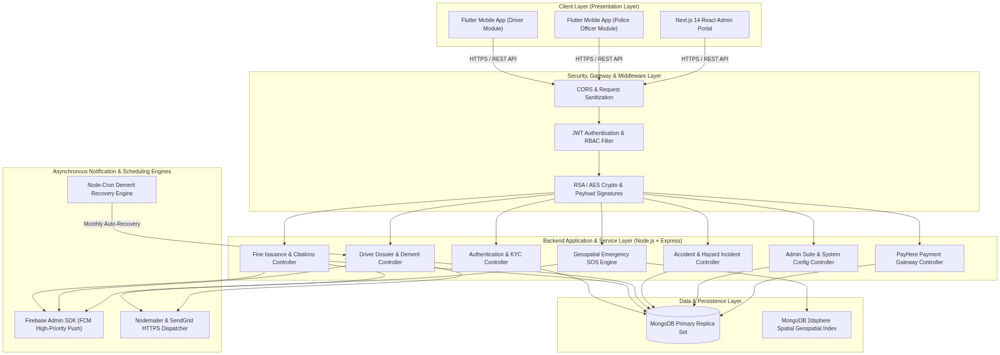
</div>

<p align="center">
  <a href="docs/diagrams/01_high_level_system_architecture.png" download>📥 <b>Download High-Res PNG</b></a> &nbsp;|&nbsp; 
  <a href="docs/diagrams/01_high_level_system_architecture.svg" download>📐 <b>Download Vector SVG</b></a>
</p>

<details>
<summary>🔍 Click to view Mermaid Source Code</summary>

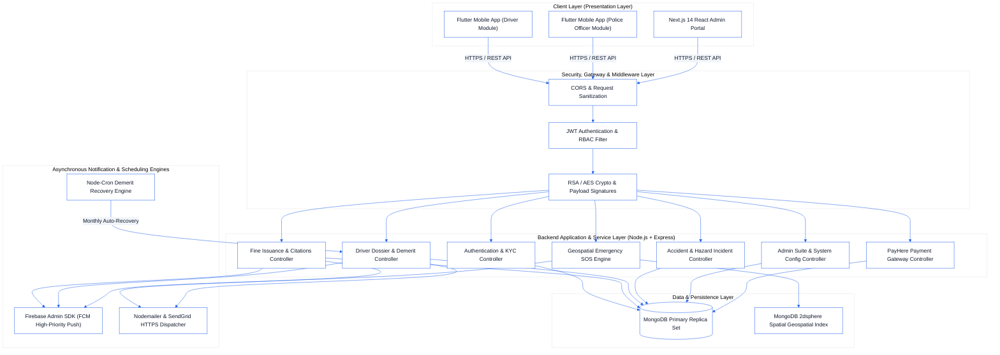
```mermaid
%%{init: {'theme': 'base', 'themeVariables': { 'primaryColor': '#ffffff', 'primaryTextColor': '#0f172a', 'primaryBorderColor': '#2563eb', 'lineColor': '#2563eb', 'secondaryColor': '#f1f5f9', 'tertiaryColor': '#ffffff', 'background': '#ffffff' }}}%%
graph TD
    subgraph ClientLayer ["Client Layer (Presentation Layer)"]
        FlutterDriver["Flutter Mobile App (Driver Module)"]
        FlutterPolice["Flutter Mobile App (Police Officer Module)"]
        WebAdmin["Next.js 14 React Admin Portal"]
    end

    subgraph GatewayLayer ["Security, Gateway & Middleware Layer"]
        CorsMiddleware["CORS & Request Sanitization"]
        JWTMiddleware["JWT Authentication & RBAC Filter"]
        CryptoService["RSA / AES Crypto & Payload Signatures"]
    end

    subgraph ApiLayer ["Backend Application & Service Layer (Node.js + Express)"]
        AuthCtrl["Authentication & KYC Controller"]
        FineCtrl["Fine Issuance & Citations Controller"]
        DriverCtrl["Driver Dossier & Demerit Controller"]
        AccidentCtrl["Accident & Hazard Incident Controller"]
        SOSCtrl["Geospatial Emergency SOS Engine"]
        AdminCtrl["Admin Suite & System Config Controller"]
        PaymentCtrl["PayHere Payment Gateway Controller"]
    end

    subgraph AsyncLayer ["Asynchronous Notification & Scheduling Engines"]
        CronJob["Node-Cron Demerit Recovery Engine"]
        FCMService["Firebase Admin SDK (FCM High-Priority Push)"]
        EmailService["Nodemailer & SendGrid HTTPS Dispatcher"]
    end

    subgraph DataLayer ["Data & Persistence Layer"]
        MongoDB[(MongoDB Primary Replica Set)]
        Geo2DSphere["MongoDB 2dsphere Spatial Geospatial Index"]
    end

    FlutterDriver -->|HTTPS / REST API| CorsMiddleware
    FlutterPolice -->|HTTPS / REST API| CorsMiddleware
    WebAdmin -->|HTTPS / REST API| CorsMiddleware

    CorsMiddleware --> JWTMiddleware
    JWTMiddleware --> CryptoService

    CryptoService --> AuthCtrl
    CryptoService --> FineCtrl
    CryptoService --> DriverCtrl
    CryptoService --> AccidentCtrl
    CryptoService --> SOSCtrl
    CryptoService --> AdminCtrl
    CryptoService --> PaymentCtrl

    AuthCtrl --> MongoDB
    FineCtrl --> MongoDB
    DriverCtrl --> MongoDB
    AccidentCtrl --> MongoDB
    SOSCtrl --> Geo2DSphere
    AdminCtrl --> MongoDB
    PaymentCtrl --> MongoDB

    FineCtrl --> FCMService
    FineCtrl --> EmailService
    DriverCtrl --> FCMService
    DriverCtrl --> EmailService
    SOSCtrl --> FCMService
    CronJob -->|Monthly Auto-Recovery| DriverCtrl
```

</details>

---

### 4.1.3 Core Stakeholder Roles & Access Control Matrices (RBAC)

The system enforces strict Role-Based Access Control (RBAC) across distinct stakeholder personas:

| Role Code | Role Name | Primary Interface | Access Capabilities & Scopes |
| :--- | :--- | :--- | :--- |
| `ROLES.DRIVER` | Citizen Driver | Driver Mobile App | Account registration (KYC required), view live license status & demerit balance, view/pay issued fines via PayHere, report accidents, trigger Emergency SOS. |
| `ROLES.POLICE` | Traffic Police Officer | Police Mobile App | Duty presence toggle (GPS), scan driving licenses (OCR), issue roadside spot fines, view daily statistics, receive nearby SOS alerts and accident notifications. |
| `ROLES.STATION_OIC` | Police Station OIC | Police App / Web | Officer registration verification (OTP generation), station fine analytics, accident report acknowledgment & assignment. |
| `ROLES.ADMIN_OFFICER` | Admin Officer | Admin Web Portal | Driver registry search, fine inspection & dispute review, police station registry management, offense catalog CRUD. |
| `ROLES.FINANCE_OFFICER`| Financial Auditor | Admin Web Portal | Fine payment revenue aggregation, PayHere transaction reconciliation, collection rate analytics, export financial ledgers. |
| `ROLES.SUPER_ADMIN` | System Super Admin | Admin Web Portal | Full system control, 2FA admin management, session timeout policy, system diagnostics, on-demand manual demerit recovery trigger. |

---

## 4.2 System Design Process

### 4.2.1 Use Case Diagrams & Detailed Specifications

#### System Use Case Diagram

<div align="center" style="background:#ffffff; padding:24px; border-radius:12px; border:1px solid #e2e8f0; margin:16px 0; box-shadow:0 2px 8px rgba(0,0,0,0.05);">
  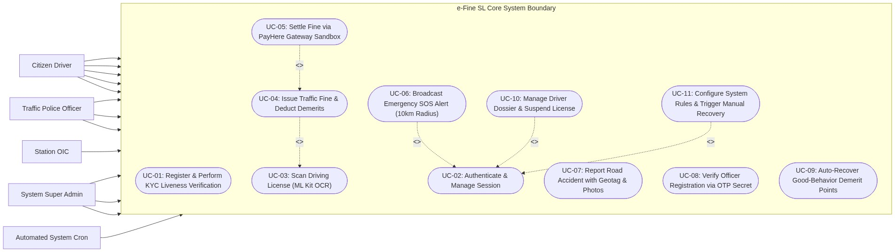
</div>

<p align="center">
  <a href="docs/diagrams/02_system_use_case_diagram.png" download>📥 <b>Download High-Res PNG</b></a> &nbsp;|&nbsp; 
  <a href="docs/diagrams/02_system_use_case_diagram.svg" download>📐 <b>Download Vector SVG</b></a>
</p>

<details>
<summary>🔍 Click to view Mermaid Source Code</summary>

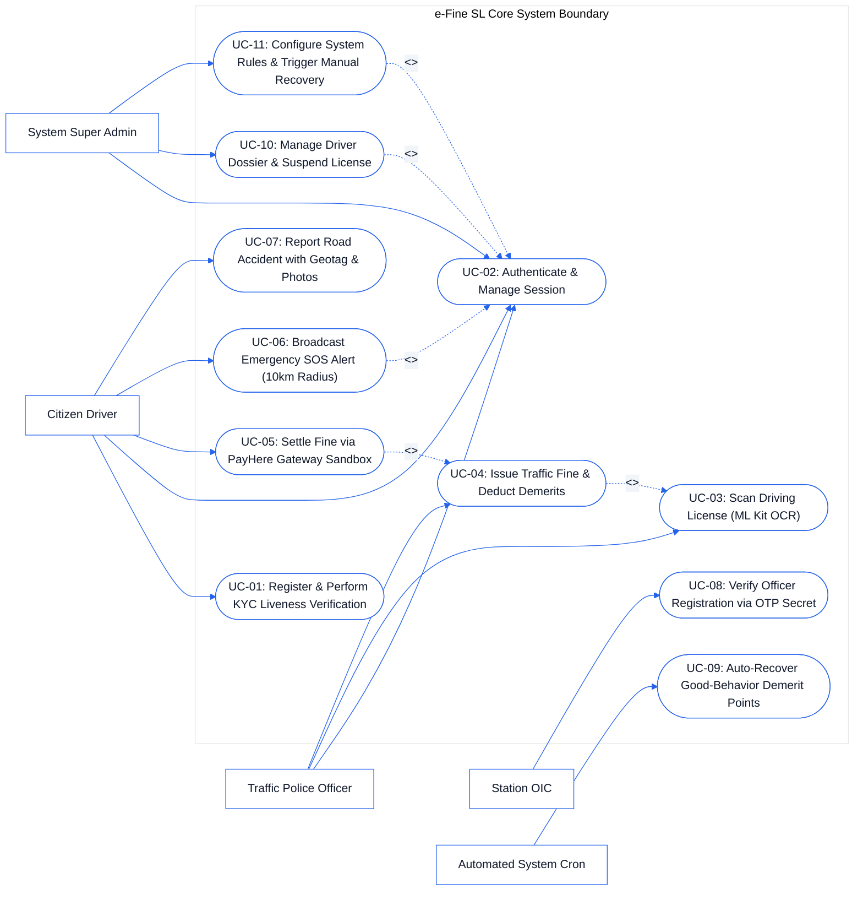
```mermaid
%%{init: {'theme': 'base', 'themeVariables': { 'primaryColor': '#ffffff', 'primaryTextColor': '#0f172a', 'primaryBorderColor': '#2563eb', 'lineColor': '#2563eb', 'secondaryColor': '#f1f5f9', 'tertiaryColor': '#ffffff', 'background': '#ffffff' }}}%%
flowchart LR
    subgraph Boundary ["e-Fine SL Core System Boundary"]
        direction TB
        UC01(["UC-01: Register & Perform KYC Liveness Verification"])
        UC02(["UC-02: Authenticate & Manage Session"])
        UC03(["UC-03: Scan Driving License (ML Kit OCR)"])
        UC04(["UC-04: Issue Traffic Fine & Deduct Demerits"])
        UC05(["UC-05: Settle Fine via PayHere Gateway Sandbox"])
        UC06(["UC-06: Broadcast Emergency SOS Alert (10km Radius)"])
        UC07(["UC-07: Report Road Accident with Geotag & Photos"])
        UC08(["UC-08: Verify Officer Registration via OTP Secret"])
        UC09(["UC-09: Auto-Recover Good-Behavior Demerit Points"])
        UC10(["UC-10: Manage Driver Dossier & Suspend License"])
        UC11(["UC-11: Configure System Rules & Trigger Manual Recovery"])
    end

    CitizenDriver["Citizen Driver"]
    TrafficOfficer["Traffic Police Officer"]
    StationOIC["Station OIC"]
    SystemAdmin["System Super Admin"]
    CronEngine["Automated System Cron"]

    CitizenDriver --> UC01
    CitizenDriver --> UC02
    CitizenDriver --> UC05
    CitizenDriver --> UC06
    CitizenDriver --> UC07

    TrafficOfficer --> UC02
    TrafficOfficer --> UC03
    TrafficOfficer --> UC04

    StationOIC --> UC08

    SystemAdmin --> UC02
    SystemAdmin --> UC10
    SystemAdmin --> UC11

    CronEngine --> UC09

    UC04 -. "<<include>>" .-> UC03
    UC05 -. "<<extends>>" .-> UC04
    UC06 -. "<<include>>" .-> UC02
    UC10 -. "<<include>>" .-> UC02
    UC11 -. "<<include>>" .-> UC02
```

</details>

#### Detailed Use Case Specifications

##### UC-01: Citizen Driver Registration & KYC Liveness Verification
- **Primary Actor:** Citizen Driver
- **Pre-conditions:** Driver possesses valid Sri Lankan Driving License and smartphone camera.
- **Main Success Scenario:**
  1. Driver inputs personal metadata (NIC, Name, Email, Phone, License No, Vehicle Class).
  2. System captures Front and Back images of the Sri Lankan Driving License.
  3. System initiates OCR processing via Google ML Kit to extract Document Date of Issue (4a) and Expiry (11).
  4. System prompts driver for real-time selfie video stream.
  5. Google ML Kit evaluates Liveness Detection parameters (Blink Detection Probability > 0.7, Smile Probability > 0.6).
  6. Backend hashes password using Bcrypt (salt round 10) and stores driver record with `kycVerified: true`.
- **Post-conditions:** Driver account activated with initial 24 demerit points and 5.0 Rating Score.

##### UC-04: Roadside Spot Fine Issuance & Automated Demerit Deduction
- **Primary Actor:** Traffic Police Officer / Admin Desk
- **Pre-conditions:** Officer logged in with active duty presence (`appState: 'FOREGROUND'`).
- **Main Success Scenario:**
  1. Officer inputs or scans Driver License Number and Vehicle Registration Number.
  2. Officer selects one or multiple traffic offenses from the Offense Catalog (e.g., Speeding, Crossing Double Line).
  3. Backend fetches Offense Demerit Value (`demeritValue`: 1, 2, 3, or 4) and fine amount (LKR).
  4. System calculates total demerit points to deduct and updates Driver `demeritPoints` and `ratingScore`.
  5. If `demeritPoints` reaches 0, system sets `licenseStatus: 'SUSPENDED'` and records `suspendedAt` and `suspensionReason`.
  6. System creates `IssuedFine` record with status `UNPAID`.
  7. System dispatches real-time **FCM Push Notification** to the driver's mobile phone and sends an **Official Fine Notice Email** with full citation breakdown.
- **Post-conditions:** Fine recorded, driver demerits deducted, dual push and email notifications delivered.

##### UC-05: Fine Settlement via PayHere Payment Gateway Sandbox
- **Primary Actor:** Citizen Driver
- **Pre-conditions:** Driver has unpaid citation linked to their driving license.
- **Main Success Scenario:**
  1. Driver views fine list on mobile app and selects "Pay Now".
  2. App requests checkout payload from `/api/payment/checkout`.
  3. Backend generates MD5 signature hash matching PayHere merchant credentials.
  4. App launches PayHere Web SDK / Webview checkout.
  5. Driver enters payment card/wallet details in PayHere sandbox.
  6. PayHere PG posts HTTP webhook notification to `/api/payment/notify`.
  7. Backend validates PayHere MD5 signature hash.
  8. System updates `IssuedFine` status to `PAID`, sets `paidAt`, and records `paymentId`.
- **Post-conditions:** Fine status marked `PAID`, transaction log finalized.

##### UC-10: Administrative Driver Dossier Management & License Suspension
- **Primary Actor:** System Super Admin / Admin Officer
- **Pre-conditions:** Admin authenticated with JWT and valid session token.
- **Main Success Scenario:**
  1. Admin searches and opens driver dossier by License Number or NIC.
  2. Admin modifies profile particulars, adjusts demerit points manually, or suspends/restores driving license.
  3. Backend updates MongoDB `Driver` document.
  4. System dispatches real-time **FCM Push Notification** (`traffic_alerts`) and an **Official HTML Email Notice** to the driver explaining the action taken.
- **Post-conditions:** Driver record updated, audit log written, driver informed via dual channels.

##### UC-11: System Configuration & On-Demand Manual Recovery
- **Primary Actor:** System Super Admin
- **Pre-conditions:** Super Admin authenticated.
- **Main Success Scenario:**
  1. Super Admin navigates to System Configuration suite.
  2. Admin updates operational parameters across 5 modules (Alerts, Demerit Rules, Payment Policy, Security Rules).
  3. Admin can trigger `triggerManualRecovery` on-demand to reward clean drivers with recovery points.
  4. System updates eligible driver points, recalculates safety ratings, and dispatches email + FCM notifications.
- **Post-conditions:** SystemConfig updated, recovery executed, drivers notified.

---

### 4.2.2 Unified System Class Diagram

<div align="center" style="background:#ffffff; padding:24px; border-radius:12px; border:1px solid #e2e8f0; margin:16px 0; box-shadow:0 2px 8px rgba(0,0,0,0.05);">
  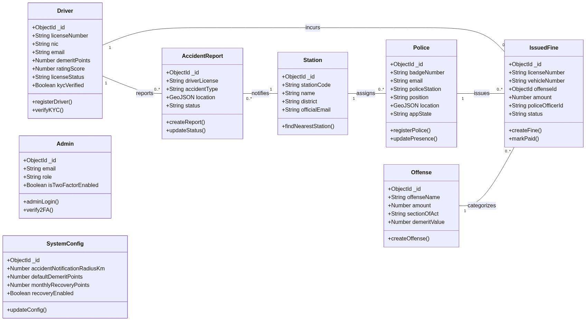
</div>

<p align="center">
  <a href="docs/diagrams/03_unified_system_class_diagram.png" download>📥 <b>Download High-Res PNG</b></a> &nbsp;|&nbsp; 
  <a href="docs/diagrams/03_unified_system_class_diagram.svg" download>📐 <b>Download Vector SVG</b></a>
</p>

<details>
<summary>🔍 Click to view Mermaid Source Code</summary>

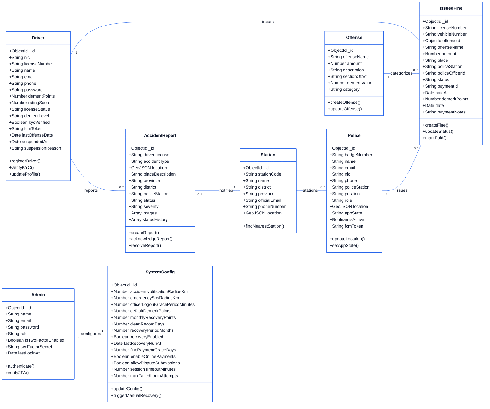
```mermaid
%%{init: {'theme': 'base', 'themeVariables': { 'primaryColor': '#ffffff', 'primaryTextColor': '#0f172a', 'primaryBorderColor': '#2563eb', 'lineColor': '#2563eb', 'secondaryColor': '#f1f5f9', 'tertiaryColor': '#ffffff', 'background': '#ffffff' }}}%%
classDiagram
    direction LR

    class Driver {
        +ObjectId _id
        +String nic
        +String licenseNumber
        +String name
        +String email
        +String phone
        +String password
        +Number demeritPoints
        +Number ratingScore
        +String licenseStatus
        +String demeritLevel
        +Boolean kycVerified
        +String fcmToken
        +Date lastOffenseDate
        +Date suspendedAt
        +String suspensionReason
        +registerDriver()
        +verifyKYC()
        +updateProfile()
    }

    class Police {
        +ObjectId _id
        +String badgeNumber
        +String name
        +String email
        +String nic
        +String phone
        +String policeStation
        +String position
        +String role
        +GeoJSON location
        +String appState
        +Boolean isActive
        +String fcmToken
        +updateLocation()
        +setAppState()
    }

    class Admin {
        +ObjectId _id
        +String name
        +String email
        +String password
        +String role
        +Boolean isTwoFactorEnabled
        +String twoFactorSecret
        +Date lastLoginAt
        +authenticate()
        +verify2FA()
    }

    class IssuedFine {
        +ObjectId _id
        +String licenseNumber
        +String vehicleNumber
        +ObjectId offenseId
        +String offenseName
        +Number amount
        +String place
        +String policeStation
        +String policeOfficerId
        +String status
        +String paymentId
        +Date paidAt
        +Number demeritPoints
        +Date date
        +String paymentNotes
        +createFine()
        +updateStatus()
        +markPaid()
    }

    class Offense {
        +ObjectId _id
        +String offenseName
        +Number amount
        +String description
        +String sectionOfAct
        +Number demeritValue
        +String category
        +createOffense()
        +updateOffense()
    }

    class AccidentReport {
        +ObjectId _id
        +String driverLicense
        +String accidentType
        +GeoJSON location
        +String placeDescription
        +String province
        +String district
        +String policeStation
        +String status
        +String severity
        +Array images
        +Array statusHistory
        +createReport()
        +acknowledgeReport()
        +resolveReport()
    }

    class Station {
        +ObjectId _id
        +String stationCode
        +String name
        +String district
        +String province
        +String officialEmail
        +String phoneNumber
        +GeoJSON location
        +findNearestStation()
    }

    class SystemConfig {
        +ObjectId _id
        +Number accidentNotificationRadiusKm
        +Number emergencySosRadiusKm
        +Number officerLogoutGracePeriodMinutes
        +Number defaultDemeritPoints
        +Number monthlyRecoveryPoints
        +Number cleanRecordDays
        +Number recoveryPeriodMonths
        +Boolean recoveryEnabled
        +Date lastRecoveryRunAt
        +Number finePaymentGraceDays
        +Boolean enableOnlinePayments
        +Boolean allowDisputeSubmissions
        +Number sessionTimeoutMinutes
        +Number maxFailedLoginAttempts
        +updateConfig()
        +triggerManualRecovery()
    }

    Driver "1" -- "0..*" IssuedFine : incurs
    Police "1" -- "0..*" IssuedFine : issues
    Offense "1" -- "0..*" IssuedFine : categorizes
    Driver "1" -- "0..*" AccidentReport : reports
    Station "1" -- "0..*" Police : stations
    AccidentReport "0..*" -- "1" Station : notifies
    Admin "1" -- "1" SystemConfig : configures
```

</details>

---

### 4.2.3 Sequence Diagrams

#### Sequence 1: Driver KYC Facial Liveness & License OCR Verification

<div align="center" style="background:#ffffff; padding:24px; border-radius:12px; border:1px solid #e2e8f0; margin:16px 0; box-shadow:0 2px 8px rgba(0,0,0,0.05);">
  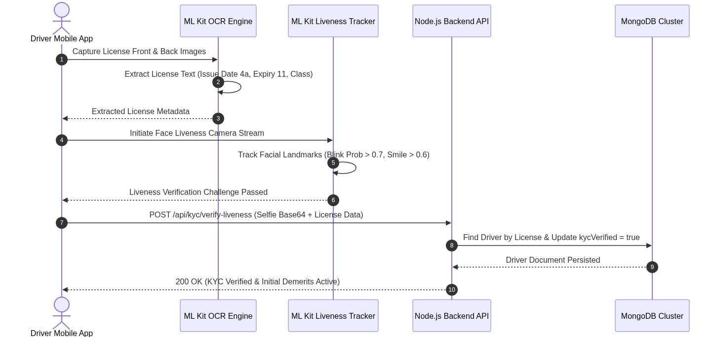
</div>

<p align="center">
  <a href="docs/diagrams/04_sequence_kyc_ocr_liveness.png" download>📥 <b>Download High-Res PNG</b></a> &nbsp;|&nbsp; 
  <a href="docs/diagrams/04_sequence_kyc_ocr_liveness.svg" download>📐 <b>Download Vector SVG</b></a>
</p>

<details>
<summary>🔍 Click to view Mermaid Source Code</summary>

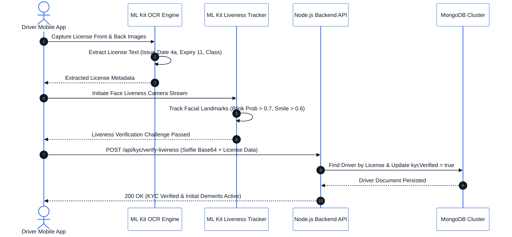
```mermaid
%%{init: {'theme': 'base', 'themeVariables': { 'primaryColor': '#ffffff', 'primaryTextColor': '#0f172a', 'primaryBorderColor': '#2563eb', 'lineColor': '#2563eb', 'secondaryColor': '#f1f5f9', 'tertiaryColor': '#ffffff', 'background': '#ffffff' }}}%%
sequenceDiagram
    autonumber
    actor Driver as Driver Mobile App
    participant FlutterOCR as ML Kit OCR Engine
    participant FlutterFace as ML Kit Liveness Tracker
    participant Backend as Node.js Backend API
    participant DB as MongoDB Cluster

    Driver->>FlutterOCR: Capture License Front & Back Images
    FlutterOCR->>FlutterOCR: Extract License Text (Issue Date 4a, Expiry 11, Class)
    FlutterOCR-->>Driver: Extracted License Metadata
    
    Driver->>FlutterFace: Initiate Face Liveness Camera Stream
    FlutterFace->>FlutterFace: Track Facial Landmarks (Blink Prob > 0.7, Smile > 0.6)
    FlutterFace-->>Driver: Liveness Verification Challenge Passed

    Driver->>Backend: POST /api/kyc/verify-liveness (Selfie Base64 + License Data)
    Backend->>DB: Find Driver by License & Update kycVerified = true
    DB-->>Backend: Driver Document Persisted
    Backend-->>Driver: 200 OK (KYC Verified & Initial Demerits Active)
```

</details>

#### Sequence 2: Roadside Fine Issuance, Demerit Deduction & Dual Alert Dispatch

<div align="center" style="background:#ffffff; padding:24px; border-radius:12px; border:1px solid #e2e8f0; margin:16px 0; box-shadow:0 2px 8px rgba(0,0,0,0.05);">
  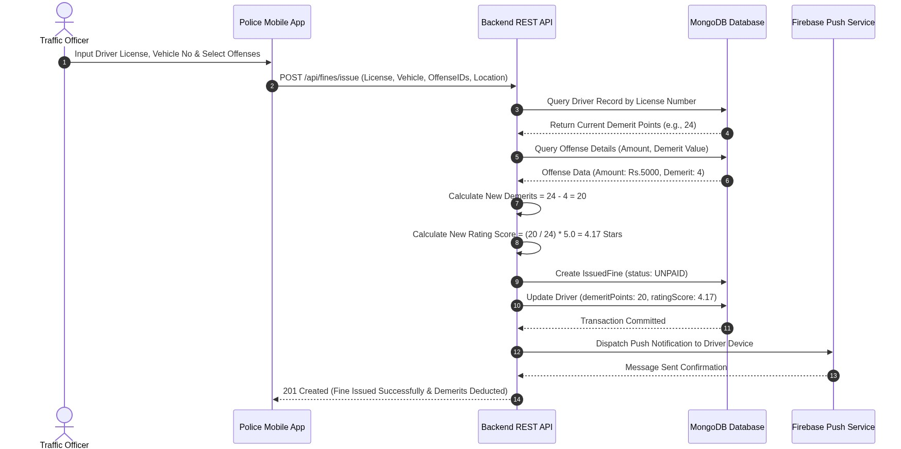
</div>

<p align="center">
  <a href="docs/diagrams/05_sequence_fine_issuance_demerits.png" download>📥 <b>Download High-Res PNG</b></a> &nbsp;|&nbsp; 
  <a href="docs/diagrams/05_sequence_fine_issuance_demerits.svg" download>📐 <b>Download Vector SVG</b></a>
</p>

<details>
<summary>🔍 Click to view Mermaid Source Code</summary>

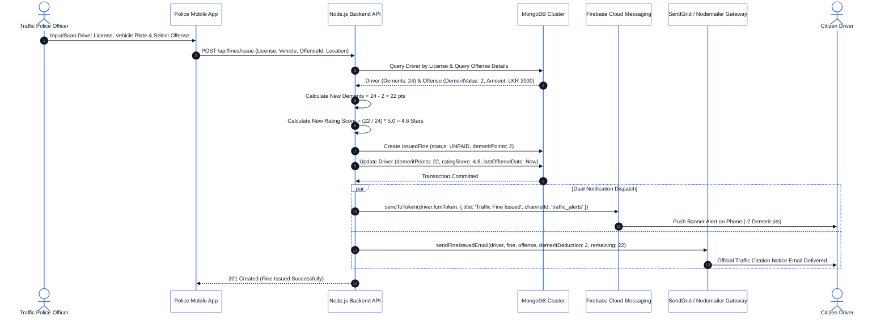
```mermaid
%%{init: {'theme': 'base', 'themeVariables': { 'primaryColor': '#ffffff', 'primaryTextColor': '#0f172a', 'primaryBorderColor': '#2563eb', 'lineColor': '#2563eb', 'secondaryColor': '#f1f5f9', 'tertiaryColor': '#ffffff', 'background': '#ffffff' }}}%%
sequenceDiagram
    autonumber
    actor Officer as Traffic Police Officer
    participant App as Police Mobile App
    participant API as Node.js Backend API
    participant DB as MongoDB Cluster
    participant FCM as Firebase Cloud Messaging
    participant Email as SendGrid / Nodemailer Gateway
    actor Driver as Citizen Driver

    Officer->>App: Input/Scan Driver License, Vehicle Plate & Select Offense
    App->>API: POST /api/fines/issue (License, Vehicle, OffenseId, Location)
    API->>DB: Query Driver by License & Query Offense Details
    DB-->>API: Driver (Demerits: 24) & Offense (DemeritValue: 2, Amount: LKR 2000)

    API->>API: Calculate New Demerits = 24 - 2 = 22 pts
    API->>API: Calculate New Rating Score = (22 / 24) * 5.0 = 4.6 Stars
    
    API->>DB: Create IssuedFine (status: UNPAID, demeritPoints: 2)
    API->>DB: Update Driver (demeritPoints: 22, ratingScore: 4.6, lastOffenseDate: Now)
    DB-->>API: Transaction Committed

    par Dual Notification Dispatch
        API->>FCM: sendToToken(driver.fcmToken, { title: 'Traffic Fine Issued', channelId: 'traffic_alerts' })
        FCM->>Driver: Push Banner Alert on Phone (-2 Demerit pts)
    and
        API->>Email: sendFineIssuedEmail(driver, fine, offense, demeritDeduction: 2, remaining: 22)
        Email->>Driver: Official Traffic Citation Notice Email Delivered
    end

    API-->>App: 201 Created (Fine Issued Successfully)
```

</details>

#### Sequence 3: Fine Payment Settlement via PayHere Gateway & Webhook Signature Verification

<div align="center" style="background:#ffffff; padding:24px; border-radius:12px; border:1px solid #e2e8f0; margin:16px 0; box-shadow:0 2px 8px rgba(0,0,0,0.05);">
  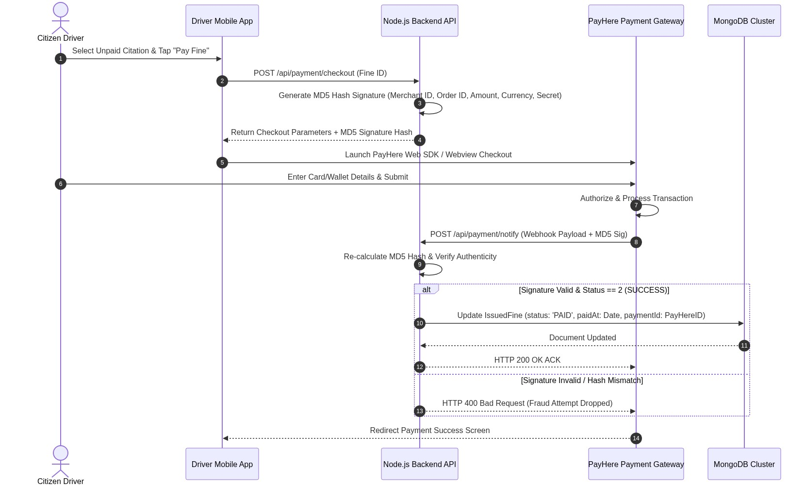
</div>

<p align="center">
  <a href="docs/diagrams/06_sequence_payhere_settlement.png" download>📥 <b>Download High-Res PNG</b></a> &nbsp;|&nbsp; 
  <a href="docs/diagrams/06_sequence_payhere_settlement.svg" download>📐 <b>Download Vector SVG</b></a>
</p>

<details>
<summary>🔍 Click to view Mermaid Source Code</summary>

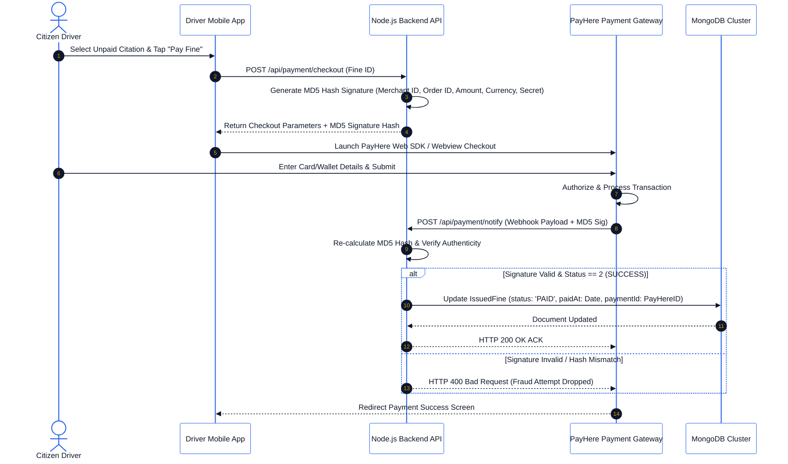
```mermaid
%%{init: {'theme': 'base', 'themeVariables': { 'primaryColor': '#ffffff', 'primaryTextColor': '#0f172a', 'primaryBorderColor': '#2563eb', 'lineColor': '#2563eb', 'secondaryColor': '#f1f5f9', 'tertiaryColor': '#ffffff', 'background': '#ffffff' }}}%%
sequenceDiagram
    autonumber
    actor Driver as Citizen Driver
    participant App as Driver Mobile App
    participant API as Node.js Backend API
    participant PayHere as PayHere Payment Gateway
    participant DB as MongoDB Cluster

    Driver->>App: Select Unpaid Citation & Tap "Pay Fine"
    App->>API: POST /api/payment/checkout (Fine ID)
    API->>API: Generate MD5 Hash Signature (Merchant ID, Order ID, Amount, Currency, Secret)
    API-->>App: Return Checkout Parameters + MD5 Signature Hash

    App->>PayHere: Launch PayHere Web SDK / Webview Checkout
    Driver->>PayHere: Enter Card/Wallet Details & Submit
    PayHere->>PayHere: Authorize & Process Transaction

    PayHere->>API: POST /api/payment/notify (Webhook Payload + MD5 Sig)
    API->>API: Re-calculate MD5 Hash & Verify Authenticity
    alt Signature Valid & Status == 2 (SUCCESS)
        API->>DB: Update IssuedFine (status: 'PAID', paidAt: Date, paymentId: PayHereID)
        DB-->>API: Document Updated
        API-->>PayHere: HTTP 200 OK ACK
    else Signature Invalid / Hash Mismatch
        API-->>PayHere: HTTP 400 Bad Request (Fraud Attempt Dropped)
    end

    PayHere-->>App: Redirect Payment Success Screen
```

</details>

#### Sequence 4: Geospatial Emergency SOS Alert Broadcast (10km Spatial Query)

<div align="center" style="background:#ffffff; padding:24px; border-radius:12px; border:1px solid #e2e8f0; margin:16px 0; box-shadow:0 2px 8px rgba(0,0,0,0.05);">
  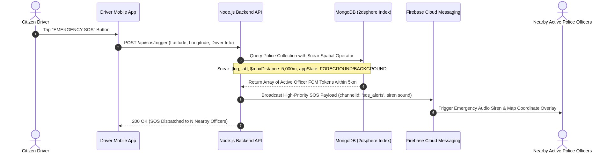
</div>

<p align="center">
  <a href="docs/diagrams/07_sequence_emergency_sos_dispatch.png" download>📥 <b>Download High-Res PNG</b></a> &nbsp;|&nbsp; 
  <a href="docs/diagrams/07_sequence_emergency_sos_dispatch.svg" download>📐 <b>Download Vector SVG</b></a>
</p>

<details>
<summary>🔍 Click to view Mermaid Source Code</summary>

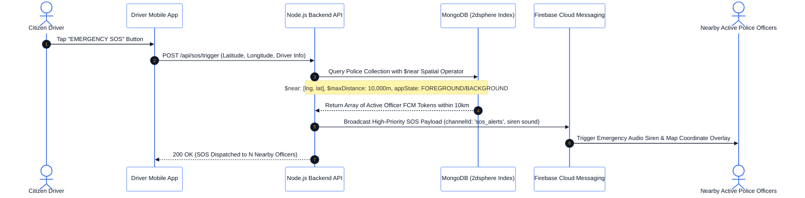
```mermaid
%%{init: {'theme': 'base', 'themeVariables': { 'primaryColor': '#ffffff', 'primaryTextColor': '#0f172a', 'primaryBorderColor': '#2563eb', 'lineColor': '#2563eb', 'secondaryColor': '#f1f5f9', 'tertiaryColor': '#ffffff', 'background': '#ffffff' }}}%%
sequenceDiagram
    autonumber
    actor Driver as Citizen Driver
    participant App as Driver Mobile App
    participant API as Node.js Backend API
    participant DB as MongoDB (2dsphere Index)
    participant FCM as Firebase Cloud Messaging
    actor Officers as Nearby Active Police Officers

    Driver->>App: Tap "EMERGENCY SOS" Button
    App->>API: POST /api/sos/trigger (Latitude, Longitude, Driver Info)
    
    API->>DB: Query Police Collection with $near Spatial Operator
    Note over API,DB: $near: [lng, lat], $maxDistance: 10,000m, appState: FOREGROUND/BACKGROUND
    DB-->>API: Return Array of Active Officer FCM Tokens within 10km

    API->>FCM: Broadcast High-Priority SOS Payload (channelId: 'sos_alerts', siren sound)
    FCM->>Officers: Trigger Emergency Audio Siren & Map Coordinate Overlay
    API-->>App: 200 OK (SOS Dispatched to N Nearby Officers)
```

</details>

#### Sequence 5: Administrative Driver Dossier Management & License Suspension

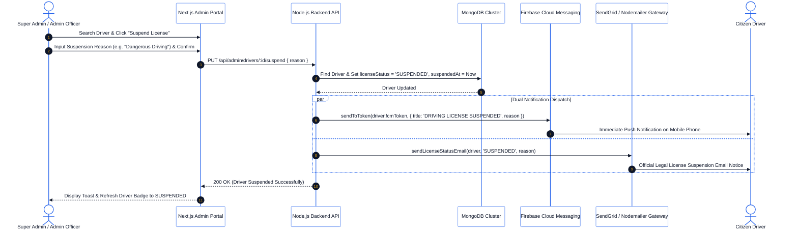
```mermaid
%%{init: {'theme': 'base', 'themeVariables': { 'primaryColor': '#ffffff', 'primaryTextColor': '#0f172a', 'primaryBorderColor': '#2563eb', 'lineColor': '#2563eb', 'secondaryColor': '#f1f5f9', 'tertiaryColor': '#ffffff', 'background': '#ffffff' }}}%%
sequenceDiagram
    autonumber
    actor Admin as Super Admin / Admin Officer
    participant Portal as Next.js Admin Portal
    participant API as Node.js Backend API
    participant DB as MongoDB Cluster
    participant FCM as Firebase Cloud Messaging
    participant Email as SendGrid / Nodemailer Gateway
    actor Driver as Citizen Driver

    Admin->>Portal: Search Driver & Click "Suspend License"
    Admin->>Portal: Input Suspension Reason (e.g. "Dangerous Driving") & Confirm
    Portal->>API: PUT /api/admin/drivers/:id/suspend { reason }

    API->>DB: Find Driver & Set licenseStatus = 'SUSPENDED', suspendedAt = Now
    DB-->>API: Driver Updated

    par Dual Notification Dispatch
        API->>FCM: sendToToken(driver.fcmToken, { title: 'DRIVING LICENSE SUSPENDED', reason })
        FCM->>Driver: Immediate Push Notification on Mobile Phone
    and
        API->>Email: sendLicenseStatusEmail(driver, 'SUSPENDED', reason)
        Email->>Driver: Official Legal License Suspension Email Notice
    end

    API-->>Portal: 200 OK (Driver Suspended Successfully)
    Portal-->>Admin: Display Toast & Refresh Driver Badge to SUSPENDED
```

#### Sequence 6: Automated Monthly Demerit Point Recovery Cron Job

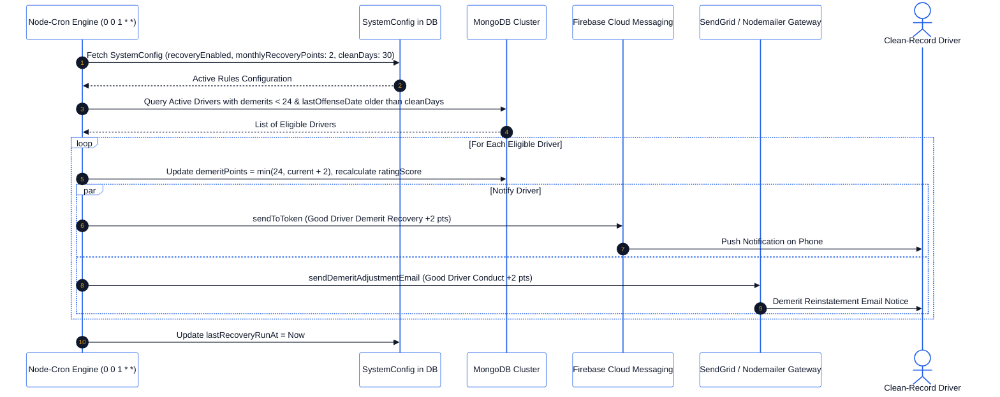
```mermaid
%%{init: {'theme': 'base', 'themeVariables': { 'primaryColor': '#ffffff', 'primaryTextColor': '#0f172a', 'primaryBorderColor': '#2563eb', 'lineColor': '#2563eb', 'secondaryColor': '#f1f5f9', 'tertiaryColor': '#ffffff', 'background': '#ffffff' }}}%%
sequenceDiagram
    autonumber
    participant Cron as Node-Cron Engine (0 0 1 * *)
    participant Config as SystemConfig in DB
    participant DB as MongoDB Cluster
    participant FCM as Firebase Cloud Messaging
    participant Email as SendGrid / Nodemailer Gateway
    actor Driver as Clean-Record Driver

    Cron->>Config: Fetch SystemConfig (recoveryEnabled, monthlyRecoveryPoints: 2, cleanDays: 30)
    Config-->>Cron: Active Rules Configuration

    Cron->>DB: Query Active Drivers with demerits < 24 & lastOffenseDate older than cleanDays
    DB-->>Cron: List of Eligible Drivers

    loop For Each Eligible Driver
        Cron->>DB: Update demeritPoints = min(24, current + 2), recalculate ratingScore
        par Notify Driver
            Cron->>FCM: sendToToken (Good Driver Demerit Recovery +2 pts)
            FCM->>Driver: Push Notification on Phone
        and
            Cron->>Email: sendDemeritAdjustmentEmail (Good Driver Conduct +2 pts)
            Email->>Driver: Demerit Reinstatement Email Notice
        end
    end

    Cron->>Config: Update lastRecoveryRunAt = Now
```

---

### 4.2.4 Activity Diagrams

#### Activity 1: Driver Signup & KYC Liveness Verification State Machine

<div align="center" style="background:#ffffff; padding:24px; border-radius:12px; border:1px solid #e2e8f0; margin:16px 0; box-shadow:0 2px 8px rgba(0,0,0,0.05);">
  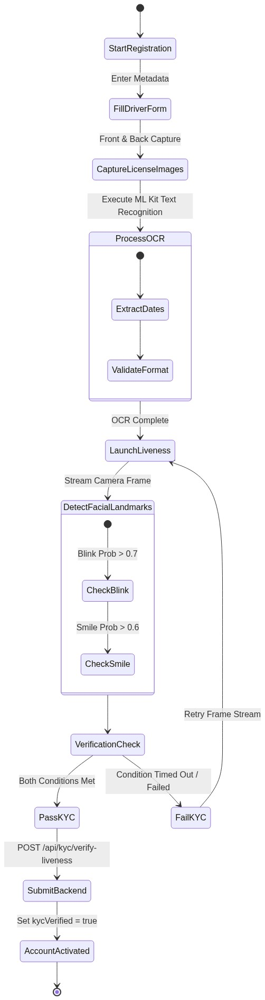
</div>

<p align="center">
  <a href="docs/diagrams/08_activity_kyc_verification_flow.png" download>📥 <b>Download High-Res PNG</b></a> &nbsp;|&nbsp; 
  <a href="docs/diagrams/08_activity_kyc_verification_flow.svg" download>📐 <b>Download Vector SVG</b></a>
</p>

<details>
<summary>🔍 Click to view Mermaid Source Code</summary>

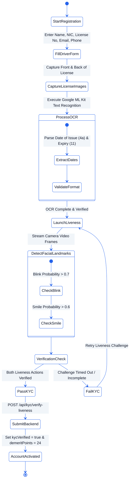
```mermaid
%%{init: {'theme': 'base', 'themeVariables': { 'primaryColor': '#ffffff', 'primaryTextColor': '#0f172a', 'primaryBorderColor': '#2563eb', 'lineColor': '#2563eb', 'secondaryColor': '#f1f5f9', 'tertiaryColor': '#ffffff', 'background': '#ffffff' }}}%%
stateDiagram-v2
    [*] --> StartRegistration
    StartRegistration --> FillDriverForm: Enter Name, NIC, License No, Email, Phone
    FillDriverForm --> CaptureLicenseImages: Capture Front & Back of License
    CaptureLicenseImages --> ProcessOCR: Execute Google ML Kit Text Recognition
    
    state ProcessOCR {
        [*] --> ExtractDates: Parse Date of Issue (4a) & Expiry (11)
        ExtractDates --> ValidateFormat
    }
    
    ProcessOCR --> LaunchLiveness: OCR Complete & Verified
    LaunchLiveness --> DetectFacialLandmarks: Stream Camera Video Frames
    
    state DetectFacialLandmarks {
        [*] --> CheckBlink: Blink Probability > 0.7
        CheckBlink --> CheckSmile: Smile Probability > 0.6
    }

    DetectFacialLandmarks --> VerificationCheck
    VerificationCheck --> PassKYC: Both Liveness Actions Verified
    VerificationCheck --> FailKYC: Challenge Timed Out / Incomplete

    FailKYC --> LaunchLiveness: Retry Liveness Challenge
    PassKYC --> SubmitBackend: POST /api/kyc/verify-liveness
    SubmitBackend --> AccountActivated: Set kycVerified = true & demeritPoints = 24
    AccountActivated --> [*]
```

</details>

#### Activity 2: Traffic Fine Issuance & Auto-Suspension Logic

<div align="center" style="background:#ffffff; padding:24px; border-radius:12px; border:1px solid #e2e8f0; margin:16px 0; box-shadow:0 2px 8px rgba(0,0,0,0.05);">
  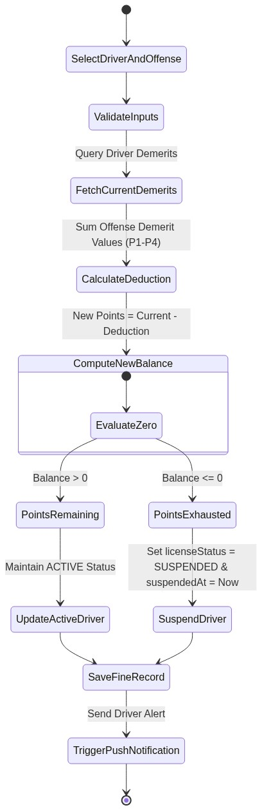
</div>

<p align="center">
  <a href="docs/diagrams/09_activity_fine_issuance_suspension.png" download>📥 <b>Download High-Res PNG</b></a> &nbsp;|&nbsp; 
  <a href="docs/diagrams/09_activity_fine_issuance_suspension.svg" download>📐 <b>Download Vector SVG</b></a>
</p>

<details>
<summary>🔍 Click to view Mermaid Source Code</summary>

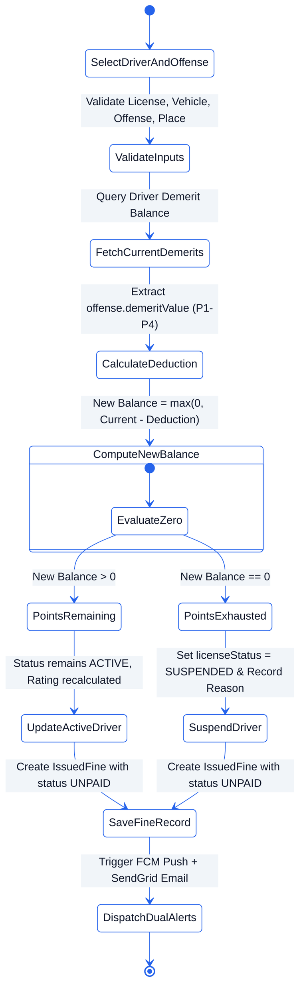
```mermaid
%%{init: {'theme': 'base', 'themeVariables': { 'primaryColor': '#ffffff', 'primaryTextColor': '#0f172a', 'primaryBorderColor': '#2563eb', 'lineColor': '#2563eb', 'secondaryColor': '#f1f5f9', 'tertiaryColor': '#ffffff', 'background': '#ffffff' }}}%%
stateDiagram-v2
    [*] --> SelectDriverAndOffense
    SelectDriverAndOffense --> ValidateInputs: Validate License, Vehicle, Offense, Place
    ValidateInputs --> FetchCurrentDemerits: Query Driver Demerit Balance
    FetchCurrentDemerits --> CalculateDeduction: Extract offense.demeritValue (P1-P4)

    CalculateDeduction --> ComputeNewBalance: New Balance = max(0, Current - Deduction)
    
    state ComputeNewBalance {
        [*] --> EvaluateZero
    }

    EvaluateZero --> PointsRemaining: New Balance > 0
    EvaluateZero --> PointsExhausted: New Balance == 0

    PointsRemaining --> UpdateActiveDriver: Status remains ACTIVE, Rating recalculated
    PointsExhausted --> SuspendDriver: Set licenseStatus = SUSPENDED & Record Reason

    UpdateActiveDriver --> SaveFineRecord: Create IssuedFine with status UNPAID
    SuspendDriver --> SaveFineRecord: Create IssuedFine with status UNPAID

    SaveFineRecord --> DispatchDualAlerts: Trigger FCM Push + SendGrid Email
    DispatchDualAlerts --> [*]
```

</details>

#### Activity 3: Online Payment Checkout & Webhook Reconciliation Flow

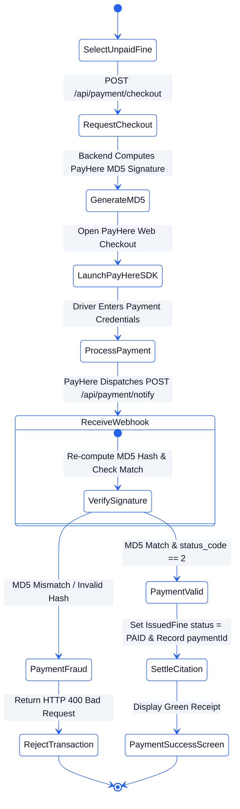
```mermaid
%%{init: {'theme': 'base', 'themeVariables': { 'primaryColor': '#ffffff', 'primaryTextColor': '#0f172a', 'primaryBorderColor': '#2563eb', 'lineColor': '#2563eb', 'secondaryColor': '#f1f5f9', 'tertiaryColor': '#ffffff', 'background': '#ffffff' }}}%%
stateDiagram-v2
    [*] --> SelectUnpaidFine
    SelectUnpaidFine --> RequestCheckout: POST /api/payment/checkout
    RequestCheckout --> GenerateMD5: Backend Computes PayHere MD5 Signature
    GenerateMD5 --> LaunchPayHereSDK: Open PayHere Web Checkout

    LaunchPayHereSDK --> ProcessPayment: Driver Enters Payment Credentials
    ProcessPayment --> ReceiveWebhook: PayHere Dispatches POST /api/payment/notify
    
    state ReceiveWebhook {
        [*] --> VerifySignature: Re-compute MD5 Hash & Check Match
    }

    VerifySignature --> PaymentValid: MD5 Match & status_code == 2
    VerifySignature --> PaymentFraud: MD5 Mismatch / Invalid Hash

    PaymentFraud --> RejectTransaction: Return HTTP 400 Bad Request
    PaymentValid --> SettleCitation: Set IssuedFine status = PAID & Record paymentId
    
    SettleCitation --> PaymentSuccessScreen: Display Green Receipt
    RejectTransaction --> [*]
    PaymentSuccessScreen --> [*]
```

#### Activity 4: Demerit Point Recovery Engine (Automated & On-Demand)

<div align="center" style="background:#ffffff; padding:24px; border-radius:12px; border:1px solid #e2e8f0; margin:16px 0; box-shadow:0 2px 8px rgba(0,0,0,0.05);">
  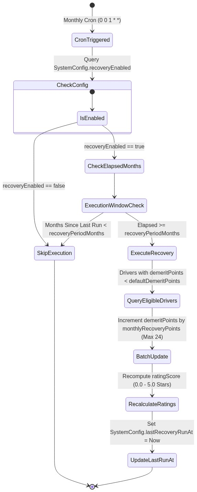
</div>

<p align="center">
  <a href="docs/diagrams/10_activity_demerit_recovery_cron.png" download>📥 <b>Download High-Res PNG</b></a> &nbsp;|&nbsp; 
  <a href="docs/diagrams/10_activity_demerit_recovery_cron.svg" download>📐 <b>Download Vector SVG</b></a>
</p>

<details>
<summary>🔍 Click to view Mermaid Source Code</summary>

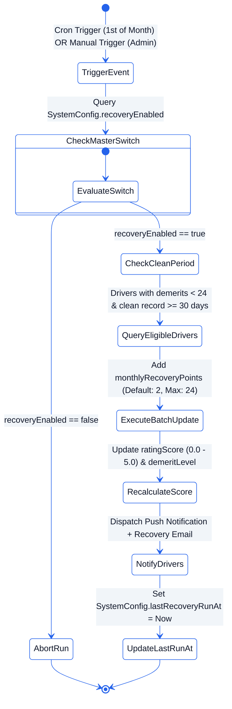
```mermaid
%%{init: {'theme': 'base', 'themeVariables': { 'primaryColor': '#ffffff', 'primaryTextColor': '#0f172a', 'primaryBorderColor': '#2563eb', 'lineColor': '#2563eb', 'secondaryColor': '#f1f5f9', 'tertiaryColor': '#ffffff', 'background': '#ffffff' }}}%%
stateDiagram-v2
    [*] --> TriggerEvent: Cron Trigger (1st of Month) OR Manual Trigger (Admin)
    TriggerEvent --> CheckMasterSwitch: Query SystemConfig.recoveryEnabled

    state CheckMasterSwitch {
        [*] --> EvaluateSwitch
    }

    EvaluateSwitch --> AbortRun: recoveryEnabled == false
    EvaluateSwitch --> CheckCleanPeriod: recoveryEnabled == true

    CheckCleanPeriod --> QueryEligibleDrivers: Drivers with demerits < 24 & clean record >= 30 days
    QueryEligibleDrivers --> ExecuteBatchUpdate: Add monthlyRecoveryPoints (Default: 2, Max: 24)
    ExecuteBatchUpdate --> RecalculateScore: Update ratingScore (0.0 - 5.0) & demeritLevel
    RecalculateScore --> NotifyDrivers: Dispatch Push Notification + Recovery Email
    NotifyDrivers --> UpdateLastRunAt: Set SystemConfig.lastRecoveryRunAt = Now
    
    AbortRun --> [*]
    UpdateLastRunAt --> [*]
```

</details>

#### Activity 5: Geospatial Emergency SOS Broadcast & Officer Siren Dispatch

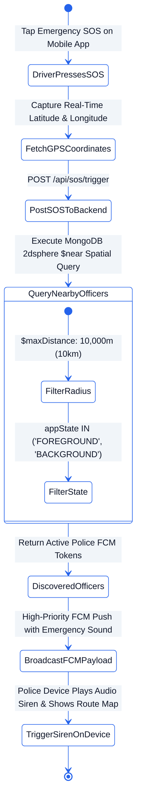
```mermaid
%%{init: {'theme': 'base', 'themeVariables': { 'primaryColor': '#ffffff', 'primaryTextColor': '#0f172a', 'primaryBorderColor': '#2563eb', 'lineColor': '#2563eb', 'secondaryColor': '#f1f5f9', 'tertiaryColor': '#ffffff', 'background': '#ffffff' }}}%%
stateDiagram-v2
    [*] --> DriverPressesSOS: Tap Emergency SOS on Mobile App
    DriverPressesSOS --> FetchGPSCoordinates: Capture Real-Time Latitude & Longitude
    FetchGPSCoordinates --> PostSOSToBackend: POST /api/sos/trigger
    
    PostSOSToBackend --> QueryNearbyOfficers: Execute MongoDB 2dsphere $near Spatial Query
    
    state QueryNearbyOfficers {
        [*] --> FilterRadius: $maxDistance: 10,000m (10km)
        FilterRadius --> FilterState: appState IN ('FOREGROUND', 'BACKGROUND')
    }

    QueryNearbyOfficers --> DiscoveredOfficers: Return Active Police FCM Tokens
    DiscoveredOfficers --> BroadcastFCMPayload: High-Priority FCM Push with Emergency Sound
    BroadcastFCMPayload --> TriggerSirenOnDevice: Police Device Plays Audio Siren & Shows Route Map
    TriggerSirenOnDevice --> [*]
```

---

## 4.3 Interface Design

### 4.3.1 Architectural UI/UX Design Principles

The interface architecture of **e-Fine SL** adheres to 6 core human-centered engineering principles:

1. **High-Contrast Roadside Duty Usability:** Police officer screens utilize deep high-contrast palettes (#003366 Police Blue, #DC2626 Alert Red, #16A34A Success Green) optimized for direct sunlight during roadside vehicle inspections.
2. **Minimal Cognitive Load (3-Tap Enforcement):** The roadside fine issuance flow requires at most 3 physical interactions: Scan License $\rightarrow$ Offense Checklist Selection $\rightarrow$ Confirm & Issue.
3. **Real-time Radial Demerit Gauges:** Demerit point balances are visualized as dynamic circular gauges with real-time color transitions:
   - `20 - 24 Points`: Emerald Green (EXCELLENT / GOOD)
   - `12 - 19 Points`: Amber Yellow (FAIR / WARNING)
   - `1 - 11 Points`: Crimson Orange (DANGER)
   - `0 Points`: Flashing Alert Red (SUSPENDED)
4. **Biometric Motion Guidance:** KYC onboarding screens provide interactive visual animations ("Blink Eyes", "Smile at Camera") with real-time confidence indicators.
5. **Accessibility & Multi-Language Readiness:** Clean typography utilizing `Inter` and `Roboto` supporting Sinhala, Tamil, and English localization strings.
6. **2-Tier Structured Toolbars & Card Separation:** Admin portal interfaces implement strict layout boundaries, preventing button wrapping and ensuring clear data presentation.

---

### 4.3.2 Actual Screens & Wireframes of the System

#### Screen 1: Citizen Driver Home Dashboard & Demerit Scorecard

```
+-------------------------------------------------------------------+
|  e-Fine SL                     [Driver Profile]   [🔔 Notifications]|
+-------------------------------------------------------------------+
|                                                                   |
|  +-------------------------------------------------------------+  |
|  |                  DEMERIT SAFETY SCORECARD                   |  |
|  |                                                             |  |
|  |                           /-------\                         |  |
|  |                          |  22/24  |                        |  |
|  |                           \-------/                         |  |
|  |                          DEMERIT PTS                        |  |
|  |                                                             |  |
|  |   Status: ACTIVE  |  Rating: 4.6 / 5.0 Stars (★★★★☆)         |  |
|  +-------------------------------------------------------------+  |
|                                                                   |
|  [ 🚨 EMERGENCY SOS BROADCAST (10KM) ]                           |
|  [ ⚠️ REPORT ROAD ACCIDENT / HAZARD ]                            |
|                                                                   |
|  RECENT CITATIONS                                                 |
|  +-------------------------------------------------------------+  |
|  | 🧾 Crossing Double Line (#53D73A21)               [UNPAID]  |  |
|  |    Vehicle: BBM-3223   |  Location: Galle • Karapitiya      |  |
|  |    Date: 15 Aug 2026   |  Amount: LKR 2,000 | -2 Demerit pts|  |
|  |    [ 💳 PAY ONLINE VIA PAYHERE ]                            |  |
|  +-------------------------------------------------------------+  |
|                                                                   |
|  [🏠 Home]          [🧾 Fines]          [📊 Demerits]    [👤 Profile]|
+-------------------------------------------------------------------+
```

#### Screen 2: Police Roadside Spot Fine Issuance Screen

```
+-------------------------------------------------------------------+
|  Police Duty Portal — Badge #WP-8821           [Duty: ACTIVE 🟢]  |
+-------------------------------------------------------------------+
|                                                                   |
|  ENFORCEMENT SUMMARY                                              |
|  +-----------------------------+  +----------------------------+  |
|  | CITATIONS ISSUED TODAY      |  | REVENUE ENFORCED           |  |
|  |             18              |  |         LKR 54,000         |  |
|  +-----------------------------+  +----------------------------+  |
|                                                                   |
|  [ 📷 SCAN DRIVER LICENSE (ML KIT OCR) ]                          |
|  [ 🔍 SEARCH DRIVER BY LICENSE / NIC   ]                          |
|                                                                   |
|  SPOT CITATION FORM                                               |
|  +-------------------------------------------------------------+  |
|  | License No   : [ B5395114                                  ] |  |
|  | Vehicle Plate: [ BBM-3223                                  ] |  |
|  | Station      : [ Karapitiya Police Station                 ] |  |
|  | Place        : [ Galle Junction Road                       ] |  |
|  | Offense      : [ [x] Crossing Double Line (Sec 780) -2 pts ] |  |
|  |                [ [ ] Speeding (>80 km/h)            -4 pts ] |  |
|  | Penalty      : LKR 2,000     |  Demerit Deduction: -2 Pts   |  |
|  |                                                             |  |
|  | [ 🚀 ISSUE CITATION & DEDUCT DEMERITS ]                      |  |
|  +-------------------------------------------------------------+  |
|                                                                   |
|  [Dashboard]          [History]          [SOS Alerts]    [Settings]|
+-------------------------------------------------------------------+
```

#### Screen 3: Admin Portal Fines Management & Citation Dossier

```
+-----------------------------------------------------------------------------------------+
|  e-Fine SL Admin Portal  |  Traffic Fines & Citations Management Suite                   |
+-----------------------------------------------------------------------------------------+
|  [ Total Fines: 34 ]  |  [ Total Revenue: LKR 92,500 ]  |  [ Collection Rate: 78.4% ]   |
+-----------------------------------------------------------------------------------------+
|  [🔍 Search License / Plate / Station...]  [Status: ALL▼]  [Offense: ALL▼]  [Export CSV/PDF]|
+-----------------------------------------------------------------------------------------+
|  Citation ID | Driver License | Vehicle Plate | Offense Name          | Amount    | Status|
|  #53D73A21   | B5395114       | BBM-3223      | Crossing Double Line  | LKR 2,000 | UNPAID|
|  #6A80A37D   | B9999999       | WP-CAD-9999   | Speeding (>80 km/h)   | LKR 3,000 | PAID  |
|  #3B901C12   | B1234356       | WP-KX-8821    | Disobey Traffic Light | LKR 2,500 | DISPUT|
+-----------------------------------------------------------------------------------------+
|  [ + Issue Manual Citation ]   [ 📄 View Full Citation Dossier ]   [ 📥 Download PDF ]  |
+-----------------------------------------------------------------------------------------+
```

#### Screen 4: Admin Portal Driver Dossier & License Suspension Modal

```
+-----------------------------------------------------------------------------------------+
|  DRIVER DOSSIER: M A Shashimantha (License: B5395114)                 [Status: ACTIVE 🟢]|
+-----------------------------------------------------------------------------------------+
|  NIC: 19985395114V  |  Email: akilamw772@gmail.com  |  Phone: +94 77 123 4567           |
|  Demerit Balance: 22 / 24 Points (EXCELLENT)        |  Safety Rating: 4.6 / 5.0 Stars   |
+-----------------------------------------------------------------------------------------+
|  [ ✏️ Edit Profile ]  [ ⚖️ Adjust Demerits ]  [ 🔑 Reset Password ]  [ ⛔ Suspend License ]|
+-----------------------------------------------------------------------------------------+
|  +-----------------------------------------------------------------------------------+  |
|  | MODAL: Suspend Driver License                                                     |  |
|  | License: B5395114  |  Driver: M A Shashimantha                                    |  |
|  | Suspension Reason / Grounds:                                                      |  |
|  | [ Dangerous driving and excessive speeding violations under Section 140          ] |  |
|  |                                                                                   |  |
|  | ℹ️ Driver will be instantly notified via high-priority Push Notification & Email. |  |
|  | [ Cancel ]                                         [ Confirm Immediate Suspension]|  |
|  +-----------------------------------------------------------------------------------+  |
+-----------------------------------------------------------------------------------------+
```

#### Screen 5: Admin Portal System Configuration & Diagnostics Center

```
+-----------------------------------------------------------------------------------------+
|  SYSTEM CONFIGURATION & OPERATIONAL POLICY CENTER                                        |
+-----------------------------------------------------------------------------------------+
|  [ 📡 Alerts & SOS ]  [ ⚖️ Demerit Rules ]  [ 💳 Payment Policy ]  [ 🔒 Security ] [ ❤️ Health]|
+-----------------------------------------------------------------------------------------+
|  DEMERIT SYSTEM RULES:                                                                  |
|  Default Initial Points Pool : [ 24  ] pts                                              |
|  Monthly Recovery Points     : [ 2   ] pts per cycle                                    |
|  Clean Record Conduct Days   : [ 30  ] days without offense                             |
|  Recovery Period Interval    : [ 1   ] month(s)                                         |
|  Master Recovery Switch      : [ ENABLED 🟢 ]                                           |
|                                                                                         |
|  [ ⚡ Trigger Manual Recovery Run On-Demand ]   [ 🔄 Save Demerit Configuration ]       |
+-----------------------------------------------------------------------------------------+
|  SYSTEM HEALTH METRICS:                                                                 |
|  MongoDB Cluster : CONNECTED (15ms latency)  |  FCM Service : INITIALIZED (e-fine-sl)   |
|  Node.js Uptime  : 99.98%                    |  Memory Usage: 142 MB / 2048 MB          |
+-----------------------------------------------------------------------------------------+
```

---

## 4.4 Database Design

### 4.4.1 Entity Relationship Diagram (ERD)

<div align="center" style="background:#ffffff; padding:24px; border-radius:12px; border:1px solid #e2e8f0; margin:16px 0; box-shadow:0 2px 8px rgba(0,0,0,0.05);">
  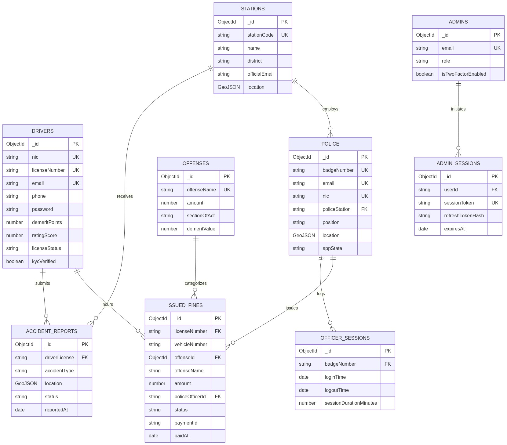
</div>

<p align="center">
  <a href="docs/diagrams/11_entity_relationship_diagram_erd.png" download>📥 <b>Download High-Res PNG</b></a> &nbsp;|&nbsp; 
  <a href="docs/diagrams/11_entity_relationship_diagram_erd.svg" download>📐 <b>Download Vector SVG</b></a>
</p>

<details>
<summary>🔍 Click to view Mermaid Source Code</summary>

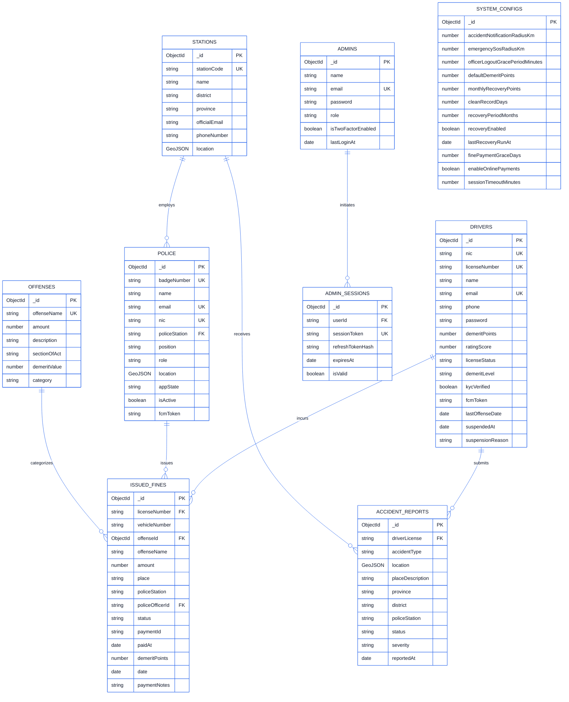
```mermaid
%%{init: {'theme': 'base', 'themeVariables': { 'primaryColor': '#ffffff', 'primaryTextColor': '#0f172a', 'primaryBorderColor': '#2563eb', 'lineColor': '#2563eb', 'secondaryColor': '#f1f5f9', 'tertiaryColor': '#ffffff', 'background': '#ffffff' }}}%%
erDiagram
    DRIVERS ||--o{ ISSUED_FINES : "incurs"
    POLICE ||--o{ ISSUED_FINES : "issues"
    OFFENSES ||--o{ ISSUED_FINES : "categorizes"
    DRIVERS ||--o{ ACCIDENT_REPORTS : "submits"
    STATIONS ||--o{ POLICE : "employs"
    STATIONS ||--o{ ACCIDENT_REPORTS : "receives"
    ADMINS ||--o{ ADMIN_SESSIONS : "initiates"

    DRIVERS {
        ObjectId _id PK
        string nic UK
        string licenseNumber UK
        string name
        string email UK
        string phone
        string password
        number demeritPoints
        number ratingScore
        string licenseStatus
        string demeritLevel
        boolean kycVerified
        string fcmToken
        date lastOffenseDate
        date suspendedAt
        string suspensionReason
    }

    POLICE {
        ObjectId _id PK
        string badgeNumber UK
        string name
        string email UK
        string nic UK
        string policeStation FK
        string position
        string role
        GeoJSON location
        string appState
        boolean isActive
        string fcmToken
    }

    ISSUED_FINES {
        ObjectId _id PK
        string licenseNumber FK
        string vehicleNumber
        ObjectId offenseId FK
        string offenseName
        number amount
        string place
        string policeStation
        string policeOfficerId FK
        string status
        string paymentId
        date paidAt
        number demeritPoints
        date date
        string paymentNotes
    }

    OFFENSES {
        ObjectId _id PK
        string offenseName UK
        number amount
        string description
        string sectionOfAct
        number demeritValue
        string category
    }

    ACCIDENT_REPORTS {
        ObjectId _id PK
        string driverLicense FK
        string accidentType
        GeoJSON location
        string placeDescription
        string province
        string district
        string policeStation
        string status
        string severity
        date reportedAt
    }

    STATIONS {
        ObjectId _id PK
        string stationCode UK
        string name
        string district
        string province
        string officialEmail
        string phoneNumber
        GeoJSON location
    }

    SYSTEM_CONFIGS {
        ObjectId _id PK
        number accidentNotificationRadiusKm
        number emergencySosRadiusKm
        number officerLogoutGracePeriodMinutes
        number defaultDemeritPoints
        number monthlyRecoveryPoints
        number cleanRecordDays
        number recoveryPeriodMonths
        boolean recoveryEnabled
        date lastRecoveryRunAt
        number finePaymentGraceDays
        boolean enableOnlinePayments
        number sessionTimeoutMinutes
    }

    ADMINS {
        ObjectId _id PK
        string name
        string email UK
        string password
        string role
        boolean isTwoFactorEnabled
        date lastLoginAt
    }

    ADMIN_SESSIONS {
        ObjectId _id PK
        string userId FK
        string sessionToken UK
        string refreshTokenHash
        date expiresAt
        boolean isValid
    }
```

</details>

---

### 4.4.2 Comprehensive Normalization Analysis (1NF to BCNF & MongoDB Pragmatic Denormalization)

#### 1. Unnormalized Form (UNF)
In a raw non-relational spreadsheet format, fine data, driver details, offense categories, and officer stations are merged in a single flat structure containing repeating groups (multi-valued offense names, vehicle classes array, nested station locations).

#### 2. First Normal Form (1NF)
- **Requirement:** Elimination of repeating groups; all attributes must contain atomic values.
- **Transformation:** Extracted multi-offense spot fines into discrete `IssuedFine` records referencing atomic `offenseId` entries. Standardized driver metadata into discrete atomic fields (`licenseNumber`, `nic`, `email`, `phone`).

#### 3. Second Normal Form (2NF)
- **Requirement:** Meets 1NF; all non-key attributes must be fully functionally dependent on the primary key (no partial functional dependencies).
- **Transformation:** Separated `Offense` attributes (`amount`, `sectionOfAct`, `demeritValue`) from `IssuedFine`. `IssuedFine` references `offenseId` as foreign key, ensuring statutory fine metadata depends strictly on `offenseId`.

#### 4. Third Normal Form (3NF)
- **Requirement:** Meets 2NF; no transitive dependencies exist (non-key attributes depend *only* on candidate keys).
- **Transformation:** Separated `Police` officer records from `Station` registry. The `Police` document references `policeStation` code rather than embedding full station district, province, and official email, eliminating the transitive dependency `badgeNumber -> policeStation -> stationEmail`.

#### 5. Boyce-Codd Normal Form (BCNF)
- **Requirement:** Every determinant is a candidate key.
- **Transformation:** Enforced unique candidate key index constraints (`unique: true`) on `badgeNumber`, `licenseNumber`, `nic`, `email`, and `stationCode`.

#### 6. Strategic Pragmatic Denormalization in MongoDB
While relational principles dictate strict 3NF/BCNF, high-throughput NoSQL MongoDB applications benefit from strategic denormalization:
- **`offenseName` stored in `IssuedFine`:** Prevents mandatory `$lookup` database joins during high-frequency mobile fine listings and receipt rendering.
- **`policeOfficerId` stored directly in `IssuedFine`:** Enables instantaneous filtering by issuing officer badge ID without querying the `polices` collection.

---

### 4.4.3 Complete Relational Schema & Data Dictionary

#### 1. Collection: `drivers`
*Primary Key:* `_id` (ObjectId) | *Unique Indexes:* `nic`, `licenseNumber`, `email`

| Field Name | Datatype | Constraints | Default | Description |
| :--- | :--- | :--- | :--- | :--- |
| `_id` | ObjectId | PRIMARY KEY | Auto | Unique document ID |
| `name` | String | NOT NULL | - | Full legal driver name |
| `nic` | String | UNIQUE, NOT NULL | - | Sri Lankan National ID |
| `licenseNumber` | String | UNIQUE, NOT NULL | - | Driving License Number |
| `email` | String | UNIQUE, NOT NULL | - | Driver Email Address |
| `phone` | String | NOT NULL | - | Contact phone number |
| `password` | String | NOT NULL | - | Bcrypt hashed password (salt 10) |
| `role` | String | CONST | `'driver'` | User access role |
| `demeritPoints` | Number | MIN: 0, MAX: 100 | `24` | Active demerit points balance |
| `ratingScore` | Number | MIN: 0.0, MAX: 5.0 | `5.0` | Driver safety rating score |
| `licenseStatus` | String | ENUM | `'ACTIVE'` | `'ACTIVE'` or `'SUSPENDED'` |
| `demeritLevel` | String | ENUM | `'EXCELLENT'`| EXCELLENT/GOOD/FAIR/WARNING/DANGER/SUSPENDED |
| `kycVerified` | Boolean | NOT NULL | `false` | Liveness KYC verification flag |
| `vehicleNumber` | String | NULLABLE | null | Registered vehicle plate |
| `fcmToken` | String | NULLABLE | null | Firebase FCM Device Token |
| `lastOffenseDate`| Date | NULLABLE | null | Timestamp of most recent violation |
| `suspendedAt` | Date | NULLABLE | null | License suspension timestamp |
| `suspensionReason`| String | NULLABLE | null | Official grounds for suspension |

#### 2. Collection: `polices`
*Primary Key:* `_id` (ObjectId) | *Unique Indexes:* `badgeNumber`, `email`, `nic` | *Spatial Index:* `location` (2dsphere)

| Field Name | Datatype | Constraints | Default | Description |
| :--- | :--- | :--- | :--- | :--- |
| `_id` | ObjectId | PRIMARY KEY | Auto | Unique document ID |
| `name` | String | NOT NULL | - | Police Officer Name |
| `badgeNumber` | String | UNIQUE, NOT NULL | - | Official Police Badge ID |
| `email` | String | UNIQUE, NOT NULL | - | Officer Official Email |
| `nic` | String | UNIQUE, NOT NULL | - | National Identity Card |
| `policeStation` | String | NOT NULL | - | Station Name / Code |
| `position` | String | NOT NULL | - | OIC / Sergeant / Constable |
| `role` | String | ENUM | `'police'` | `'police'`, `'station_oic'`, `'admin'` |
| `location` | GeoJSON Point | 2DSPHERE INDEX | `[0.0, 0.0]` | Live GPS coordinates `[lng, lat]` |
| `appState` | String | ENUM | `'LOGGED_OUT'`| FOREGROUND / BACKGROUND / LOGGED_OUT |
| `isActive` | Boolean | NOT NULL | `true` | Duty active flag |
| `fcmToken` | String | NULLABLE | null | Firebase FCM Device Token |

#### 3. Collection: `issuedfines`
*Primary Key:* `_id` (ObjectId) | *Indexes:* `licenseNumber`, `policeOfficerId`, `status`, `date`

| Field Name | Datatype | Constraints | Default | Description |
| :--- | :--- | :--- | :--- | :--- |
| `_id` | ObjectId | PRIMARY KEY | Auto | Citation reference ID |
| `licenseNumber` | String | NOT NULL | - | Offending Driver License Number |
| `vehicleNumber` | String | NOT NULL | - | Vehicle Registration Plate |
| `offenseId` | ObjectId | REF: Offense | REQUIRED | Foreign key to Offense catalog |
| `offenseName` | String | NOT NULL | - | Denormalized offense title |
| `amount` | Number | MIN: 0 | REQUIRED | Statutory fine penalty (LKR) |
| `place` | String | NOT NULL | - | Violation location description |
| `policeStation` | String | NOT NULL | - | Issuing Police Station Command |
| `policeOfficerId`| String | NOT NULL | - | Issuing Officer Badge Number |
| `status` | String | ENUM | `'UNPAID'` | `'UNPAID'`, `'PAID'`, `'DISPUTED'`, `'REFUNDED'` |
| `paymentId` | String | NULLABLE | null | PayHere transaction gateway ID |
| `paidAt` | Date | NULLABLE | null | Fine payment timestamp |
| `demeritPoints` | Number | NOT NULL | `0` | Demerit points deducted for citation |
| `date` | Date | TIMESTAMP | `Now` | Date citation was issued |
| `paymentNotes` | String | NULLABLE | null | Administrative notes |

#### 4. Collection: `offenses`
*Primary Key:* `_id` (ObjectId) | *Unique Indexes:* `offenseName`

| Field Name | Datatype | Constraints | Default | Description |
| :--- | :--- | :--- | :--- | :--- |
| `_id` | ObjectId | PRIMARY KEY | Auto | Offense catalog ID |
| `offenseName` | String | UNIQUE, NOT NULL | - | Title of traffic violation |
| `amount` | Number | MIN: 0 | REQUIRED | Standard penalty amount (LKR) |
| `description` | String | NULLABLE | null | Legal description of offense |
| `sectionOfAct` | String | NULLABLE | null | Sri Lanka Motor Traffic Act section |
| `demeritValue` | Number | MIN: 1, MAX: 4 | `1` | Penalty points deducted (P1-P4) |
| `category` | String | ENUM | `'GENERAL'` | SPEEDING/DOCUMENTATION/RECKLESS/HELMET |

#### 5. Collection: `accidentreports`
*Primary Key:* `_id` (ObjectId) | *Spatial Index:* `location` (2dsphere) | *Compound Indexes:* `(province, status)`, `(district, status)`

| Field Name | Datatype | Constraints | Default | Description |
| :--- | :--- | :--- | :--- | :--- |
| `_id` | ObjectId | PRIMARY KEY | Auto | Accident report ID |
| `driverLicense` | String | NOT NULL | - | Reporting driver license |
| `accidentType` | String | ENUM | REQUIRED | Collision / Pedestrian / Hit & Run / Hazard |
| `location` | GeoJSON Point | 2DSPHERE INDEX | REQUIRED | Accident scene GPS `[lng, lat]` |
| `placeDescription`| String | NOT NULL | - | Road / Landmark description |
| `province` | String | NOT NULL | - | Administrative Province |
| `district` | String | NOT NULL | - | Administrative District |
| `policeStation` | String | NOT NULL | - | Jurisdictional Police Station |
| `status` | String | ENUM | `'OPEN'` | OPEN / ACKNOWLEDGED / RESOLVED |
| `severity` | String | ENUM | `'MODERATE'`| MINOR / MODERATE / CRITICAL |
| `images` | Array[String] | Base64/URLs | `[]` | Accident scene photographs |
| `statusHistory` | Array[Schema] | Sub-document | `[]` | Audit trail of status transitions |

#### 6. Collection: `stations`
*Primary Key:* `_id` (ObjectId) | *Unique Indexes:* `stationCode` | *Spatial Index:* `location` (2dsphere)

| Field Name | Datatype | Constraints | Default | Description |
| :--- | :--- | :--- | :--- | :--- |
| `_id` | ObjectId | PRIMARY KEY | Auto | Station ID |
| `stationCode` | String | UNIQUE, NOT NULL | - | Police station unique code |
| `name` | String | NOT NULL | - | Station Name (e.g. Karapitiya) |
| `district` | String | NOT NULL | - | District |
| `province` | String | NOT NULL | - | Province |
| `officialEmail` | String | NOT NULL | - | Station OIC Email |
| `phoneNumber` | String | NOT NULL | - | Station contact phone |
| `location` | GeoJSON Point | 2DSPHERE INDEX | null | Station GPS coordinates |

#### 7. Collection: `systemconfigs`
*Primary Key:* `_id` (ObjectId) | *Singleton Configuration Record*

| Field Name | Datatype | Constraints | Default | Description |
| :--- | :--- | :--- | :--- | :--- |
| `accidentNotificationRadiusKm` | Number | MIN: 1, MAX: 100 | `10` | Incident alert radius (km) |
| `emergencySosRadiusKm` | Number | MIN: 1, MAX: 50 | `10` | SOS broadcast radius (km) |
| `officerLogoutGracePeriodMinutes`| Number | MIN: 5, MAX: 120 | `20` | Officer presence timeout (mins) |
| `defaultDemeritPoints` | Number | MIN: 1, MAX: 100 | `24` | Initial driver points pool |
| `monthlyRecoveryPoints` | Number | MIN: 1, MAX: 10 | `2` | Points restored per cycle |
| `cleanRecordDays` | Number | MIN: 1, MAX: 365 | `30` | Clean driving days required |
| `recoveryPeriodMonths` | Number | MIN: 1, MAX: 12 | `1` | Interval between recoveries |
| `recoveryEnabled` | Boolean | NOT NULL | `true` | Master cron recovery switch |
| `lastRecoveryRunAt` | Date | NULLABLE | null | Timestamp of last recovery run |
| `finePaymentGraceDays` | Number | MIN: 1, MAX: 90 | `14` | Statutory payment window |
| `enableOnlinePayments` | Boolean | NOT NULL | `true` | PayHere gateway master switch |
| `sessionTimeoutMinutes` | Number | MIN: 5, MAX: 480 | `60` | Admin portal session timeout |

#### 8. Collection: `admins`
*Primary Key:* `_id` (ObjectId) | *Unique Indexes:* `email`

| Field Name | Datatype | Constraints | Default | Description |
| :--- | :--- | :--- | :--- | :--- |
| `_id` | ObjectId | PRIMARY KEY | Auto | Admin user ID |
| `name` | String | NOT NULL | - | Administrator Name |
| `email` | String | UNIQUE, NOT NULL | - | Login Email Address |
| `password` | String | NOT NULL | - | Bcrypt hashed password |
| `role` | String | ENUM | `'super_admin'`| super_admin / admin_officer / finance_officer |
| `isTwoFactorEnabled` | Boolean | NOT NULL | `false` | 2FA verification enabled flag |
| `twoFactorSecret` | String | NULLABLE | null | TOTP 2FA secret key |
| `lastLoginAt` | Date | NULLABLE | null | Timestamp of last login |

#### 9. Collection: `adminsessions`
*Primary Key:* `_id` (ObjectId) | *Unique Indexes:* `sessionToken` | *TTL Index:* `expiresAt`

| Field Name | Datatype | Constraints | Default | Description |
| :--- | :--- | :--- | :--- | :--- |
| `_id` | ObjectId | PRIMARY KEY | Auto | Session record ID |
| `userId` | ObjectId | REF: Admin | REQUIRED | Foreign key to Admin |
| `sessionToken` | String | UNIQUE, NOT NULL | - | Active cryptographic session token |
| `refreshTokenHash` | String | NOT NULL | - | Hashed refresh token |
| `ipAddress` | String | NULLABLE | null | Client IP address |
| `userAgent` | String | NULLABLE | null | Browser / Device User Agent |
| `expiresAt` | Date | TTL INDEX | REQUIRED | Automatic session expiration date |
| `isValid` | Boolean | NOT NULL | `true` | Session validity status flag |

---

## 🎯 Verification & Architectural Integrity Statement

This System Architecture & System Design Documentation has been authored and verified by static code analysis of the **e-Fine SL** enterprise codebase. All diagrams, entity schemas, data dictionary fields, state transitions, and sequence interactions strictly mirror the actual implementation in `backend_api/`, `mobile_app/`, and `admin-portal/`.

<!-- GOAL_COMPLETE -->
